<!-- markdownlint-disable MD028 -->
<!-- markdownlint-disable MD029 -->
<!-- markdownlint-disable MD033 -->
<!-- markdownlint-disable MD041 -->


<p align="center">
  
  
  
</p>


<p align="center">
  
  
  
</p>

<p align="center">
  
  
  
</p>

<p align="center">
  <a href="https://deepwiki.com/Pancakes-Labs/astrbot_plugin_disaster_warning" target="_blank"></a>
  <a href="https://zread.ai/Pancakes-Labs/astrbot_plugin_disaster_warning" target="_blank"></a>

[](https://github.com/Pancakes-Labs/astrbot_plugin_disaster_warning)

---

  为 [AstrBot](https://github.com/AstrBotDevs/AstrBot) 而生的全球灾害预警与气象情报插件，聚合多机构数据源，让地震、海啸、气象、台风情报与专业分析一键直达你的 Bot。

## 📑 快速导航

<div align="center">

| 左列 | 右列 |
| :--- | :--- |
| 1. [✨ 功能特性](#-功能特性) | 13. [🏗️ 系统架构](#system-architecture) |
| 2. [🚀 安装与使用](#-安装与使用) | 14. [📈 性能报告](#-性能报告) |
| 3. [🔑 数据源鉴权引导](#data-source-auth-guide) | 15. [📒 增强的可读性日志格式](#-增强的可读性日志格式) |
| 4. [📊 推送示例](#-推送示例) | 16. [❓ 常见问题简答](#-常见问题简答) |
| 5. [🖼️ 图片渲染功能](#image-render) | 17. [⚠️ 关于预估影响区域的说明](#intensity-estimation-notes) |
| 6. [💻 WebUI 控制台](#-现代化-webui-控制台) | 18. [🤝 贡献与支持](#-贡献与支持) |
| 7. [🧪 模拟预警](#simulation-playground) | 19. [📢 免责声明](#-免责声明) |
| 8. [📡 数据源状态](#-数据源状态) | 20. [📄 许可证](#-许可证) |
| 9. [📑 插件配置项详解](#-插件配置项详解) | 21. [🙏 致谢](#-致谢) |
| 10. [📋 使用命令](#-使用命令) | 22. [📚 推荐阅读](#-推荐阅读) |
| 11. [📂 插件目录与结构](#-插件目录与结构) | 23. [📊 仓库状态](#-仓库状态) |
| 12. [💾 数据持久化与存储](#-数据持久化与存储) | 24. [⭐️ 星星](#️-星星) |

</div>

---

<!-- 开发者的话 -->
> **开发者的话：**
>
> 大家好，我是 DBJD-CR ，这是我为 AstrBot 开发的第二个插件，如果存在做的不好的地方还请理解。
>
> 写这个插件主要还是因为我自己的一点业余爱好吧，而且也比较符合我们"应急管理大学"的特色（）
>
> 虽然一开始也没抱太大希望，但没想到最终还真的搓出了个像模像样的插件。
>
> 和[主动消息插件](https://github.com/Pancakes-Labs/astrbot_plugin_proactive_chat)一样，本插件也是"Vibe Coding"的产物。
>
> 所以，**本插件的所有文件内容，全部由 AI 编写完成**，我几乎没有为该插件编写任何一行代码，仅进行了架构设计与修改部分文字描述和负责本文档的润色。所以，或许有必要添加下方的声明：

> [!WARNING]
> 本插件和文档由 AI 生成，内容仅供参考，请仔细甄别。
>
> 插件目前仍处于开发阶段，无法 100% 保证稳定性与可用性。

> 当然，这次的开发过程也没顺利到哪去。尽管用上了新的工作流，提高了很多效率。但是开发过程中还是遇到了相当多的 Bug，调试起来花了很多时间。
>
> 最终，经过了上百次 debug，我们才终于开发出一个稳定的版本。
>
> 但我还是要感谢 AI ，没有他，这个项目不可能完成。(此外还要感谢[@Aloys233](https://github.com/Aloys233)，为插件开发提供了莫大支持)
>
> 这个插件，是我们共同努力的结晶。它现在还不完美，但它的架构是稳固的，它的逻辑是清晰的（大嘘）。希望本插件能为你在防灾上提供一点小小的帮助。
>
> 在此，我也诚邀各路大佬对本插件进行测试和改进，希望大家多多指点。
>
> 如果你被这个"为爱发电"的故事打动了，或者觉得这个插件有帮助或比较实用，**欢迎你为这个插件点个** 🌟 **Star** 🌟，这是对我们的最大认可与鼓励~

> [!NOTE]
> 虽然本插件的开发过程中大量使用了 AI 进行辅助，但我保证所有内容都经过了我的严格审查，所有的 AI 生成声明都是形式上的。你可以放心参观本仓库和使用本插件。
>
> 目前插件的主要功能都能正常运转。但仍有很多可以优化的地方。

> [!TIP]
> 本项目的相关开发数据 (持续更新中)：
>
> 开发时长：累计 173 天（主插件部分）
>
> 累计工时：约 769 小时（主插件部分）
>
> Tokens Used：4,671,632,327

## ✨ 功能特性

### ⚡ 实时预警，快人一步

无需时刻盯着地震台网，你的 Bot 会替你 7×24 小时值守，第一时间推送**地震预警（EEW）、海啸、气象与台风**动态。预警不迟到、不缺席。

### 🔍 想查就查，一问即达

内置 40 条命令，天气、灾情一应俱全：气象预警、台风路径、地震列表、雷达图与动图、降水量预报、气温/降水/风速排行、气象站实况、空气质量（AQI）排行......动动手就能让 Bot 把情报送到眼前。

### 🖼️ 专业渲染，一目了然

预警不只靠文字——支持地震预警卡片、台风路径图、JMA 震央分布图、沙滩球（震源机制）、雷达动图、降水量预报图等专业级图片渲染，复杂灾害信息一张图看懂。

### 🎯 精准过滤，不打扰也不遗漏

支持按震级/烈度、距离、关键词、本地预估来精细过滤，配合报数控制，融合策略等，既不会让无关地震轰炸群聊，也不会错过重要灾情。气象、海啸与台风同样支持精细过滤。

### 🎛️ 全局掌控，配置随心

自带可视化管理后台：运行状态实时监控、历史预警回溯、数据统计图表（震级分布/趋势/热力图）、通知中心、文档浏览、预警模拟演练，还有所见即所得的配置面板，支持**会话级个性化配置**——每个群、每个人都能有自己的推送规则。

### 🛡️ 稳定可靠，省心运维

自动重连、数据源健康探测、离线通知、静默启动、日志轮转、备份管理......插件为长期稳定运行做足了保障，装好即可安心使用。

## 🚀 安装与使用

1. **下载插件**: 通过 AstrBot 的插件市场下载。或从本 GitHub 仓库的 Release 下载 `astrbot_plugin_disaster_warning` 的 `.zip` 文件，在 AstrBot WebUI 中的插件页面右下角的 `➕` 选择 `从文件安装` 。
2. **安装依赖**: 本插件的核心依赖大多已包含在 AstrBot 的默认依赖中，且在插件下载安装时会自动安装插件所需的依赖，通常无需额外安装。如果你的环境中确实缺少相关依赖，请安装：

   ```bash
   pip install python-dateutil jinja2 playwright tzdata fastapi uvicorn protobuf
   # Python < 3.11 额外安装
   pip install "tomli>=2.0.1; python_version < '3.11'"
   ```

3. **重启 AstrBot (可选)**: 如果插件没有正常加载或生效，可以尝试重启你的 AstrBot 程序。
4. **配置插件**: 进入 AstrBot WebUI，找到 `灾害预警` 插件，选择 `插件配置` 选项 (⚙️)，配置相关参数。或者在插件自带的 WebUI 中进行配置。

## <span id="data-source-auth-guide">🔑 数据源鉴权引导（重要！！！）</span>

部分数据源在上游启用了应用鉴权，未配置有效凭证时仅能使用极少数通道（如 FAN 仅 `FSSN` 服务可用），或根本无法接收实际数据。本节说明插件内所使用的数据源的凭证获取与填写方式。

### FAN Studio 应用鉴权

FAN Studio 现已启用应用鉴权，获取数据源完整能力需在配置中填写 `FAN Studio API Key`，用户需到 [API Key 申请](https://api.fanstudio.tech/dev-platform/?lang=zh) 选择本插件关联的应用申请 Key。

**申请流程：**

1. 访问 [FAN Studio 开发者平台](https://api.fanstudio.tech/dev-platform/) 。
2. **选择本插件关联的应用**，应用名为 **`astrbot plugin disaster warning`**。填写完其他必填项后提交 API Key 申请。
3. 等待审核（开发者一审与管理员二审）通过（如果长期未通过，请通过 README 内提供的联系方式联系插件作者反馈）。通过后 API Key 将会发送到你填写的邮箱中，请注意查收。
4. 在插件配置中的 `📡数据源配置` → `⚙️ FAN Studio Websocket 数据源` 中找到 `FAN Studio API Key` 的配置项，填入你的 API Key。

### EQSC Token 获取

EQSC API 需要鉴权，否则无法正常获取数据。

**Token 获取流程：**

1. 打开 [EQuake](https://github.com/SeriesNotFound/EQuake) 客户端。如果你还没有，请先下载一个: [EQuake 下载地址](https://github.com/SeriesNotFound/EQuake/releases)。
2. 点开 EQuake 程序下方的设置界面（⚙️），在侧边栏的 `一般` 中找到 **EQSC API 配置**，下方的访问令牌（以 `ARh.` 开头）即为插件所需的 Token。如果没有访问令牌或令牌已过期，请先按软件内登录流程创建或刷新一个。
3. 如果你发现令牌没法选中复制，可以使用文字提取工具或截图丢给 AI 让它帮你识别一下。注意令牌是**不包含换行**的。
4. 在插件配置中的 `📡数据源配置` → `⚙️ EQSC API 数据源` 中找到 `EQSC 访问令牌 (RefreshToken)` 配置项，填入你的令牌，并确认已打开 `启用 EQSC 数据源` 的开关。

---

> [!TIP]
> 插件已自动处理各 WebSocket 通道的鉴权数据包发送与轮询令牌刷新，你只需在配置中填写 `FAN Studio API Key` 和 `EQSC 访问令牌 (RefreshToken)` 并重载插件即可。
> EQSC 访问令牌具有有效期，到期后需要自行按上方流程重新刷新令牌并更新插件配置。

> [!IMPORTANT]
> `FAN Studio API Key` 与 `EQSC 访问令牌 (RefreshToken)` 均属于敏感凭据，可长期用于换取数据访问权限。请妥善保管，**切勿**提交到公开仓库、聊天记录或截图分享中。

### 📬 推送会话列表

现在，距离 bot 开始推送还有最后一步：正确填写需要推送的会话格式。如果你遇到了配置问题，请根据下方的流程指引完成：

1. 找到你需要推送消息的会话，@ 你的 bot（如果是私聊就直接发），发送一条 `/sid` 的指令（如果你修改了 AstrBot 的配置文件 → 平台配置 → 唤醒词，请把 `/` 改为你自定义的唤醒词）。
2. 等待 bot 回复后，将给出的 UMO 填入插件对应配置项。回复格式类似于：

```text
UMO: 「default:GroupMessage:123456789」
UID: 「987654321」
*Use UMO to set whitelist and configure routing, use UID to set admin list(UMO 可用于设置白名单和配置文件路由，UID 可用于设置管理员列表)

Your session information:
Bot ID: 「default」
Message Type: 「GroupMessage」
Session ID: 「123456789」
```

> [!WARNING]
> 请注意，你应该填写的部分是 `「」` 内的内容，即 `default:GroupMessage:123456789`，请不要把整串回复内容填进去然后来问我为什么不发消息了。
>
> 更不要照抄这里的示例或者是配置描述，一切情况以你自己实际为准。

如果是 QQ 官方机器人，类似于：

```text
UMO: 「default:GroupMessage:4C011A2B3D4C5E6F9F8E7D6C5B4A3210」
UID: 「4C011A2B3D4C5E6F9F8E7D6C5B4A3210」
*Use UMO to set whitelist and configure routing, use UID to set admin list(UMO 可用于设置白名单和配置文件路由，UID 可用于设置管理员列表)
Your session information:
Bot ID: 「default」
Message Type: 「GroupMessage」
Session ID: 「4C011A2B3D4C5E6F9F8E7D6C5B4A3210」
The group's ID: 「7E933A67F5C0AD0A128A199EFCE140B4」. Set this ID to whitelist to allow the entire group.
```

- 私聊推送请填 UMO 的部分，即 `default:FriendMessage:4C011A2B3D4C5E6F9F8E7D6C5B4A3210`。
- 群聊推送请用 `The group's ID` 替换掉 `UID` 的部分，即填写 `default:GroupMessage:7E933A67F5C0AD0A128A199EFCE140B4`。

其他平台配置流程基本类似。完成后重载插件即可开始推送。

### 📋 插件配置推荐

插件支持**会话级差异配置**，不同会话（群聊/私聊）可以拥有各自独立的推送规则，互不干扰。以下给出三种典型场景的配置思路与对应的**推送量级**，你可以根据自己对打扰程度的容忍度，按需在插件 WebUI 的 `⚙️ 配置管理` 页面中调整对应会话的配置。

#### 场景一：全量推送（默认配置）

- **适用**：测试环境、或希望第一时间掌握全部灾害动态的高关注度会话。
- **思路**：不做任何会话级覆写，完全使用插件默认配置，所有已启用的数据源全量推送。
- **推送量级**：**高**。所有满足全局过滤器的地震、气象、海啸、台风事件都会推送，低级别气象预警与频繁更新的预警报数都可能出现。
- **调节要点**：使用默认数据源开关配置、过滤器保持默认即可。若嫌消息过多，可参照「场景二」适度收紧。

#### 场景二：适度打扰（收紧过滤）

- **适用**：不希望被过多消息打扰，但仍关注本地及区域重要灾害的会话。
- **思路**：通过「**砍源 + 抬阈值 + 降频率**」三招，保留关键事件、过滤琐碎消息：
  - **砍源**：在 📡数据源配置 中关闭关注度较低的子源（如 `美国地质调查局（USGS）：地震测定`、`美国 ShakeAlert：地震预警`、`台湾中央气象署：地震报告` 等）。
  - **抬阈值**：在 🔍 地震信息过滤配置 中调高各类过滤器的门槛（如中国源 `最小震级` ≥ 4.5 或 `最小烈度` ≥ 6；日本源 `最小震级` ≥ 5.5 且 `最小震度` ≥ 4；USGS 等纯震级源 `最小震级` ≥ 5；Global Quake 提高门槛并改为全部条件满足才推送；S-Net 要求足够多的测站同时触发）。
  - **降频率**：在推送频率控制中将 `JMA：每收到 N 报推送一次` 与 `Global Quake：每收到 N 报推送一次` 调大（如每 5 报推送一次），气象预警过滤仅保留高级别（如红色）并拉长聚合推送的**时间窗口**，减少刷屏。
- **推送量级**：**中等**。仅推送真正值得关注的事件，日常微小地震与低级别气象基本不再打扰。
- **效果参考**：此场景下一天的推送数量通常在几条到几十条左右（视具体配置情况和当天灾害活动而定），可作为**群聊默认模板**——既能覆盖重要预警信息，又不会淹没群内正常交流。

#### 场景三：极简打扰（私人推送）

- **适用**：私人会话，只关心身边的地震与本地天气/台风，几乎零打扰。
- **思路**：「**本地优先 + 只留核心源**」：
  - **只留核心源**：在 `📡数据源配置` 中仅保留自己关心的数据源，其余全部关闭。
  - **私人地震卫士**：在本地监控中填写所在地的 `本地经纬度` 与 `本地地名` ，开启 `严格过滤模式` ，并将 `通知阈值(烈度)` 设为较低值，这样**只有本地有感地震才会推送**，其余地区的地震（包括大地震）一概不打扰。
  - **气象精准过滤**：在气象预警过滤器的 `关键词白名单` 中仅保留你关注的地区，并关闭**聚合推送**使其逐条直达（量少不会刷屏）；
  - **台风本地关注**：在 `🌀 台风信息配置` 中开启 `显示本地预估信息`，启用 `台风推送过滤器`，设置**距离过滤器**与**预报路径逼近过滤**。这样只当台风真正靠近时才开始推送预警。
- **推送量级**：**低**。日常本地地区无灾害活动时几乎无推送，仅本地有感地震与关注区域的重要灾害才会触达，适合作为**个人私聊**或**家人群**的模板。

> [!TIP]
> 以上示例仅描述**配置思路**与**预期效果**，具体开关项、关键词、坐标等请按你的实际情况调整。
> 三种量级之间可以继续微调：希望更安静就把阈值继续调高、关闭更多子源；希望更及时就降低阈值、缩短聚合窗口。

## 📊 推送示例

以下是插件中部分数据源的文字推送示例，Emoji 过滤模式为默认。

### 地震预警推送示例

<details>
<summary>中国地震预警网 (省级) 示例</summary>

```text
🚨[地震预警] 浙江地震局
📋第 1 报
⏰发震时间：2026年08月15日 19时30分12秒 (UTC+8)
📍震中：台湾宜兰县海域 (24.41°N, 122.60°E)
📊震级：M 5.0
🏔️深度：54.0 km
💥预估最大烈度：6.5 🟠

📍本地预估：
距离震中 1470.8 km，预估最大烈度 0.0 (⚪ 无感)
⏱️预计P波走时：约 187 秒
⏱️预计S波走时：约 333 秒
⏳S波倒计时：约 290 秒

📡预估影响区县（仅供参考）：
  🔵[烈度3] 宜兰县、新北市
  ⚪[烈度2] 基隆市、花莲县、桃园市、台北市、台中市 等13处
  ⚪[烈度1] 高雄市、嘉义市、台南市、屏东县、澎湖县 等6处
```

</details>

<details>
<summary>日本气象厅紧急地震速报示例</summary>

```text
🚨[紧急地震速报] [予报] 日本气象厅
📋第 3 报
⏰发震时间：2026年08月17日 05时37分16秒 (UTC+8)
📍震中：福岡県福岡地方 (33.50°N, 130.10°E)
📊震级：M 4.3
🏔️深度：30.0 km
💥预估最大震度：3 🟢

📍本地预估：
距离震中 2441.1 km，预估最大烈度 0.0 (⚪ 无感)
⏱️预计P波走时：约 293 秒
⏱️预计S波走时：约 528 秒
⏳S波倒计时：约 511 秒

📡预估影响地域（仅供参考）：
  🟢[震度3] 佐賀県北部、福岡県福岡、佐賀県南部
  🔵[震度2] 福岡県筑後、長崎県北部、福岡県北九州、長崎県壱岐、福岡県筑豊 等11处
  ⚪[震度1] 大分県西部、熊本県天草・芦北、大分県北部、長崎県対馬、大分県中部 等18处
```

</details>

<details>
<summary>Global Quake 地震预警示例</summary>

```text
🚨[地震预警] Global Quake
📋第 9 报
⏰发震时间：2026年01月09日 00时59分59秒 (UTC+8)
📍震中：塔吉克斯坦、中国新疆边境地区附近 (37.33°N, 74.60°E)
📊震级：M 5.4
🏔️深度：35.2 km
💥预估最大烈度：5.0 🟢
📈最大加速度：16.9 gal
📡触发测站：62/69
(地图瓦片)
```

</details>

### 地震情报推送示例

<details>
<summary>中国地震台网地震测定示例</summary>

```text
🚨[地震情报] 中国地震台网 [正式测定]
⏰发震时间：2026年01月29日 21时54分28秒 (UTC+8)
📍震中：新疆巴音郭楞州轮台县 (41.40°N, 84.46°E)
📊震级：M 3.0
🏔️深度：15.0 km
💥最大烈度：4.0 🟦
(地图瓦片)
```

</details>

<details>
<summary>日本气象厅震度速报示例</summary>

```text
🚨[震度速报] 日本气象厅
⏰发震时间：2026年07月28日 15时27分00秒 (UTC+8)
📍震中：调查中
📊震级：调查中
💥最大震度：7 🟪
🌊津波：调查中
📡各地震度详情：
  🟪[震度7] 熊本県熊本
  🟥[震度6弱] 熊本県天草・芦北
  🟧[震度5强] 長崎県島原半島
  🟧[震度5弱] 熊本県球磨、福岡県筑後、宮崎県北部山沿い、鹿児島県薩摩
  🟨[震度4] 熊本県阿蘇、長崎県南西部、宮崎県南部山沿い、佐賀県南部、大分県中部、大分県西部
  🟩[震度3] 福岡県北九州
```

</details>

<details>
<summary>日本气象厅地震情报示例 (开启详细震度)</summary>

```text
🚨[各地震度相关情报] 日本气象厅
⏰发震时间：2026年07月28日 15时27分00秒 (UTC+8)
📍震中：熊本県熊本地方 (32.60°N, 130.70°E)
📊震级：M 7.1
🏔️深度：10.0 km
💥最大震度：7 🟪
🌊津波：正在/已经发布津波警报/大津波警报
📡各地震度详情：
  🟪[震度7] 熊本県熊本
  🟥[震度6弱] 熊本県天草・芦北
  🟧[震度5强] 長崎県島原半島、鹿児島県薩摩
  🟧[震度5弱] 佐賀県南部、宮崎県北部山沿い、宮崎県北部平野部、熊本県球磨、熊本県阿蘇、福岡県筑後、長崎県南西部
  🟨[震度4] 大分県中部、大分県北部、大分県南部、大分県西部、宮崎県南部山沿い、宮崎県南部平野部、山口県西部、愛媛県南予、福岡県北九州、福岡県筑豊、長崎県北部、鹿児島県甑島
  🟩[震度3] 佐賀県北部、山口県中部、山口県北部、山口県東部、島根県西部、広島県南西部、愛媛県中予、愛媛県東予、福岡県福岡、長崎県五島、長崎県壱岐、高知県西部、鳥取県西部、鹿児島県大隅、鹿児島県種子島
  🟦[震度2] 兵庫県北部、兵庫県淡路島、岡山県北部、岡山県南部、島根県東部、広島県北部、広島県南東部、徳島県北部、長崎県対馬、香川県東部、香川県西部、高知県中部、高知県東部、鳥取県中部、鳥取県東部
  ⬜[震度1] 兵庫県南東部、兵庫県南西部、和歌山県北部、徳島県南部、新潟県上越、鹿児島県十島村、鹿児島県屋久島
(地图瓦片)
```

</details>

<details>
<summary>FSSN 矩心矩张量解 (CMT) 示例</summary>

```text
🌐[CMT] FSSN 矩心矩张量解
⏰发震时间：2026年08月15日 18时54分51秒 (UTC+8)
📍震中：印度尼西亚苏门答腊岛北部 (2.92°N, 99.05°E)
📊震级：M 6.6（Mww 6.9 / mB 6.5 / mb 6.3 / MLv 6.8 / Mwp 6.6）
🏔️深度：164.0 km (±4.0)｜矩心深度：182.8 km
🧭节面1：走向 297.0° / 倾角 88.0° / 滑动角 -145.0°
    类型：斜滑断层（正断[57.4%] + 右旋走滑[81.9%]）[仅供参考]
🧭节面2：走向 206.0° / 倾角 55.0° / 滑动角 -3.0°
    类型：左旋走滑断层[仅供参考]
📋备注：左/右旋最终确定需依赖实际发震断层面
(震源球)
```

</details>

<details>
<summary>中国地震台网烈度速报示例</summary>

```text
🚨[烈度速报] 中国地震台网
⏰发震时间：2026年08月07日 13时08分30秒 (UTC+8)
📍震中：四川宜宾市高县 (28.51°N, 104.67°E)
📊震级：M 4.9
🏔️深度：6.0 km
💥最大仪器烈度：6.8 🟧

📝推测烈度说明：
基于 GB/T 17742-2020 中国地震烈度表，结合台站实测仪器烈度和经验模型插值计算，本次地震推测最高烈度为7度。
5度区以上面积约4376平方千米。
7度区涉及庆符镇，沙河镇，大窝镇，面积约4平方千米。
6度区涉及兴隆乡，恒丰乡，西郊街道，赵场街道，南广镇，花滩镇，李端镇，巡场镇，珙泉镇，双河乡，庆岭乡，四烈乡，复兴镇，潆溪乡，大窝镇，庆符镇，文江镇，月江镇，铜鼓乡，来复镇，沙河镇，胜天镇，三元乡，普安镇，铜锣乡，井江乡，硐底镇，竹海镇，长宁镇，面积约963平方千米。
5度区涉及筠连县，珙县，盐津县，江安县，长宁县，翠屏区，叙州区，南溪区，屏山县，兴文县，水富市，高县，面积约3409平方千米。

📡台站实测 Top5：
🟧[烈度6.8] 高县庆符镇
🟧[烈度6.5] 高县复兴镇
🟧[烈度6.5] 珙县巡场镇
🟨[烈度5.7] 盐津县兴隆乡
🟨[烈度5.6] 盐津县牛寨乡
(地图瓦片)
```

</details>

<details>
<summary>NIED S-Net 海底震度示例</summary>

```text
🚨[S-Net震度分布] NIED
⏰更新时间：2026年08月07日 01时45分00秒 (UTC+8)
📊震度降序前 5 测站：
  N.S4N24  🔴震度6弱 (5.515)
  N.S3N05  🟠震度5弱 (4.612)
  N.S3N04  🟡震度4 (4.302)
  N.S4N25  🟡震度4 (4.102)
  N.S4N23  🟡震度4 (4.004)
(S-Net 测站分布图)
```

</details>

### 海啸预警推送示例

<details>
<summary>中国海啸预警（信息）示例</summary>

```text
🌊[海啸信息] 自然资源部海啸预警中心
📋海啸信息⚪
🕒最近更新时间：2026年08月15日 08时39分03秒 (UTC+8)
🌍震源：印尼弗洛勒斯岛地区海域 (8.40°S, 121.40°E)
🧭参数：M 7.7 / 深度 20km
🔗详情：
https://obs.nmefc.cn/Warning/TsunamiAdvice/202608150558_3_file/202608150558_1.html
🗺️震中图：
https://obs.nmefc.cn/Warning/TsunamiAdvice/202608150558_3_file/Earthquake_Pos.jpg
(震中图)
```

</details>

<details>
<summary>日本气象厅津波予報示例 (数据源 EQSC)</summary>

```text
🌊[津波予報] 日本气象厅
📋津波注意報🟡
⏰发表时间：2026年07月28日 15时29分13秒 (UTC+8)
🌍震源参数：熊本県熊本地方 Mj 7.1
⏱️发震时刻：2026年07月28日 15时27分00秒 (UTC+8)

📊级别分布：津波注意報 1 / 若干の海面変動 2
🌊全域最大预估波高：１ｍ（有明・八代海）
📍津波予報区域（3）：
  • 🟡有明・八代海 [津波注意報] (津波到達中と推測) 🌊１ｍ
  • ⚪長崎県西方 [若干の海面変動] (不明) 🌊０．２ｍ未満
  • ⚪熊本県天草灘沿岸 [若干の海面変動] (不明) 🌊０．２ｍ未満
```

</details>

### 气象预警推送示例

<details>
<summary>中国气象局气象预警推送示例</summary>

```text
⚡[气象预警]
📋内蒙古通辽市开鲁县气象台发布雷电黄色预警[III级/较重]🟡
📝内蒙古通辽市开鲁县气象台2026年07月12日01时02分继续发布2026年07月11日19时23分发布的雷电黄色预警信号：6小时内开鲁县仍可能发生雷电活动，局部地区伴有短时强降水、雷暴大风、冰雹等强对流天气，可能造成雷电、洪涝、城市内涝等灾害事故。请有关单位和人员做好防范准备。
⏰生效时间：2026年07月12日 01时04分42秒 (UTC+8)
(预警图标)
```

</details>

### 台风信息推送示例

<details>
<summary>中国气象局实时活跃台风推送示例</summary>

```text
🌀[台风报文] 中国气象局
白海豚（DOLPHIN）

📌编号：2613
⚠️等级：强台风🔴
🌍中心位置：(28.1°N, 122.4°E)
📍参考位置：中国东部东岸远海附近
💨最大风速：45.0 m/s
🎈中心气压：950 hPa
🧭移动方向：正西 (21.0 KM/H)

🌪️风圈半径：(NE, SE, SW, NW)
7 级：450, 420, 300, 300 (KM)
10级：250, 220, 200, 200 (KM)
12级：100, 100, 100, 100 (KM)

🕒更新时间：2026年08月09日 12时00分00秒 (UTC+8)
(台风路径图)
```

</details>

## <span id="image-render">🖼️ 图片渲染功能</span>

插件内置基于 Playwright 的高性能图片渲染引擎与 Pillow 轻量绘图能力，同时聚合多机构官方图件资源，将枯燥的纯文本预警数据转化为极具视觉冲击力的可视化卡片与实时图件。图片能力总体可分为三大类：

- **🎨 自有渲染引擎（Playwright）**：Global Quake 预警卡片、通用地图瓦片、地震列表查询卡片、S-Net 测站分布图、台风路径图。
- **✏️ 轻量绘图渲染（Pillow）**：FSSN CMT 震源球、JMA 震央分布图。
- **🌐 外部图片资源（官方/上游图件）**：气象预警图标、海啸图件、台湾 CWA 地震报告图件、NMC 气象雷达图/动图、NMC 降水量预报图/动图。

### 🎨 自有渲染引擎 (Playwright)

基于 Playwright 的浏览器渲染引擎，能够将 HTML 模板实时截图生成高清图片卡片，视觉表现力最强，但会消耗一定的内存与渲染时间。

#### 1. Global Quake 预警卡片

目前 `Global Quake` 数据源有两种精美的主题模板可供选择，提供极致的可视化预警体验。

<details>
<summary>极光主题 (Aurora)</summary>


</details>

<details>
<summary>暗夜主题 (DarkNight)</summary>


</details>

#### 2. 通用地图瓦片 (Base Map)

现在，所有地震消息都可以附带一张**实时的地图位置卡片**。该功能基于 Leaflet.js 构建，支持多种地图源，为每一条预警提供直观的地理参考与基础事件描述。

瓦片源可在 `地图瓦片源` 配置项中切换，目前支持以下 7 种：

<details>
<summary>高德地图</summary>


</details>

<details>
<summary>PetalMap 矢量图 亮</summary>


</details>

<details>
<summary>PetalMap 矢量图 暗</summary>


</details>

<details>
<summary>ArcGIS 卫星影像</summary>


</details>

<details>
<summary>ArcGIS 地形图</summary>


</details>

<details>
<summary>ArcGIS 山影图</summary>


</details>

<details>
<summary>中科星图卫星影像</summary>

> [!WARNING]
> 该瓦片源经实测，当前在代理端返回 404，暂不可用，待上游恢复后可用。

</details>

> [!TIP]
> 台风路径图使用独立的 `台风路径图瓦片源` 配置，瓦片源选项与通用地图一致，默认 `PetalMap矢量图暗`（与台风卡片暗色主题匹配，并推荐使用暗色底图以保证可读性）。

#### 3. 地震列表查询卡片 (List Card)

使用 `/earthquake_list` 命令时，插件可以生成精美的，仿 `JQuake` 风格的历史地震列表卡片，一次性直观展示最近发生的多次地震事件及其震级、烈度/震度分布。

<details>
<summary>中国地震台网 (CENC) 地震列表卡片</summary>


> 使用指令 /earthquake_list cenc 9 生成

</details>

<details>
<summary>日本气象厅 (JMA) 地震列表卡片</summary>


> 使用指令 /earthquake_list jma 9 生成

</details>

#### 4. S-Net 测站分布图

`NIED S-Net` 海底震度推送与 `/snet` 查询命令均可附带一张测站分布图，按日本震度等级对海底测站着色，直观呈现震度分布范围。

<details>
<summary>S-Net 测站分布图示例</summary>


> 2026年08月07日 01时45分00秒，S-Net 海底震度分布情况

</details>

#### 5. 台风路径图

台风推送与 `/台风信息查询` 命令可附带基于 EQSC 富化轨迹绘制的**台风路径图**，一次性呈现历史路径、风圈半径与预报逼近路径。

<details>
<summary>台风路径图示例</summary>


> 台风 白海豚 (2613) 在 2026年08月09日 12时的台风路径图

</details>

### ✏️ 轻量绘图渲染 (Pillow)

以下渲染能力基于 Pillow 本地绘制，**不依赖浏览器**，秒级完成，资源开销远低于 Playwright 渲染。

#### 6. FSSN CMT 震源球 (Beachball)

当 `FSSN 矩心矩张量解 (CMT)` 事件带有节面参数时，推送消息会自动附带一张**震源球（沙滩球）**图片，直观展示双力偶震源机制。也可通过 `/生成沙滩球 <走向> <倾角> <滑动角> [大小] [线宽]` 命令手动生成。

<details>
<summary>震源球（沙滩球）示例</summary>


> 节面参数：走向 297.0° / 倾角 88.0° / 滑动角 -145.0°

</details>

#### 7. JMA 震央分布图

使用 `/JMA震央分布绘图` 命令，可将日本气象厅历史震央数据绘制为可视化分布图，支持 6 种投影：经度纬度（地图视图）/ 经度深度 / 纬度深度 / 经度时间 / 纬度时间 / 深度时间。

<details>
<summary>经度纬度（地图视图）</summary>


> JMA 震央分布图 — 经度纬度（地图视图）

</details>

<details>
<summary>经度深度（俯视剖面）</summary>


> 可观察地震随经度的深浅分布，识别俯冲带深部地震

</details>

<details>
<summary>纬度深度（剖面）</summary>


> 可观察地震随纬度的深浅分布，识别板块俯冲角度与 Benioff 带

</details>

<details>
<summary>深度时间（时空演化）</summary>


> 可观察地震活动的时间演化与深度变化趋势，识别余震序列与震群活动

</details>

### 🌐 外部图片资源（官方/上游图件）

以下图件来自官方/上游数据源，插件抓取后优先转 Base64 发送，抓取失败时自动回退为图片 URL，保证消息稳定送达。

#### 8. 气象预警官方图标

气象预警推送与 `/气象预警查询` 命令会根据预警类型自动附带**官方预警图标**。图标解析采用三级策略：优先使用插件本地资源库，本地缺失时回退通用颜色图标。

<details>
<summary>气象预警官方图标一览</summary>


</details>

#### 9. 自然资源部海啸图件

中国海啸预警推送会附带自然资源部海啸预警中心发布的官方**震中图**。

<details>
<summary>中国海啸预警震中图示例</summary>


> 自然资源部海啸预警中心风格的震中图

</details>

#### 10. 台湾 CWA 地震报告图件

台湾中央气象署正式地震报告推送会附带官方**报告图**与**等震度图**。

<details>
<summary>CWA 台湾地震报告图件</summary>


</details>

<details>
<summary>CWA 等震度图</summary>


</details>

#### 11. NMC 气象雷达图 / 动图

使用 `/雷达 <站点名>` 与 `/雷达动图 <站点名>` 命令，可获取中国气象局（NMC）官方气象雷达产品图与最近多帧合成的循环动图。

<details>
<summary>NMC 气象雷达图 [组合反射率] 示例</summary>


</details>

#### 12. NMC 降水量预报图 / 动图

使用 `/降水量预报 [24h|6h] [时次]` 与 `/降水量预报动图 [24h|6h]` 命令，可获取中国气象局官方降水量预报图与全时次循环动图。

<details>
<summary>NMC 降水量预报图示例</summary>


</details>

### ⚠️ 注意事项与系统要求

虽然图片渲染功能非常酷炫，但它也对运行环境提出了一定要求：

- **内存消耗 (Memory Usage)**:
  - 开启 Playwright 渲染会启动 Headless Chromium 浏览器实例。
  - 每次渲染任务大约需要消耗 **200MB - 500MB** 的瞬时内存；其中 S-Net 测站分布图与台风路径图等大画布卡片的渲染内存占用偏高。
  - **警告**: 如果您的服务器内存小于 1GB（或未配置 Swap），**建议不要开启 Playwright 渲染**，否则可能导致 Bot 进程因 OOM (Out Of Memory) 被系统杀掉。
  - **轻量替代**: 震源球、JMA 震央分布图等基于 Pillow 的绘图能力**不依赖浏览器**，资源开销远低于 Playwright 渲染，内存紧张时可优先使用。

- **环境依赖 (Dependencies)**:
  - Playwright 渲染依赖 `playwright` 库来驱动浏览器；Pillow 绘图与外部图件抓取不依赖浏览器。
  - 在 Windows 上通常可以直接使用。
  - 在 **Linux** 环境（尤其是 Docker 或最小化安装的系统）中，可能缺少浏览器运行所需的系统级依赖库（如 libgtk 等）。
  - 若遇到报错，请尝试在终端执行以下命令安装依赖：

    ```bash
    playwright install --with-deps chromium
    ```

  - **远程方案**：使用 **远程 Playwright** 避免在容器内安装浏览器。例如在配置中设置：

    ```json
    {
      "playwright_mode": "remote",
      "playwright_server_url": "ws://192.168.1.100:3000"
    }
    ```

    然后在宿主机或其他服务器上运行：`npx playwright run-server --port 3000 --host 0.0.0.0`

- **存储空间 (Storage)**：
  - 生成的图片文件会临时存储在插件数据目录下的 `temp` 文件夹中。
  - 插件内置了自动清理机制，会每隔 **24 小时** 自动清理 **3 小时前** 生成的图片，且如果文件过多也会自动提前清理，无需担心占用过多磁盘空间，但仍建议预留 200MB 左右的空间。

- **渲染延迟 (Latency)**:
  - Playwright 渲染一张高清卡片通常需要 **0.5-7 秒** 的时间，Pillow 绘图为纯 CPU 计算，秒级完成。
  - **异步分离发送**: 针对地震预警消息，插件会自动将文本消息与地图瓦片**分离发送**，确保预警时效性不受渲染耗时影响。
  - **智能报数控制**: 为了优化性能，地震预警地图图片默认仅在 **第 1...5...10...以及最终报** 时触发渲染，避免在高频更新时造成不必要的资源开销。
  - **图片缓存**: 同类图片渲染结果会短期缓存（约 3 分钟），重复事件直接复用缓存，避免重复截图消耗资源。

- **网络与图件可用性 (Network & Upstream)**:
  - 外部图件依赖上游服务器可用性。
  - 插件抓取失败时自动回退为图片 URL 发送，无法获取时该附件自动省略，不影响文字推送。
  - 部分地图瓦片源（如中科星图）可能出现上游失效的情况，此时对应瓦片无法加载，可切换其他瓦片源使用。

- **字体问题 (Fonts)**:
  - Playwright 渲染器默认使用宿主系统的字体。
  - 如果您的 Linux 服务器出现中文显示为“方框”或乱码，请安装开源中文字体（如 `fonts-noto-cjk` 或 `wqy-zenhei`）。

## 💻 现代化 WebUI 控制台

从 v1.4.0 版本开始，插件引入了全新的、功能完备的 WebUI 管理端。不用敲命令、不用改文件，打开浏览器就能完成查看状态、翻看历史、调整配置、测试推送等所有操作，一目了然。


### 🧭 七大功能页面

- **📊 运行状态**：插件的"体检报告"。一眼看清每个数据源是否正常连接、延迟高不高、重试了几次，数据源卡住时一键重连。还能看到历史状态监控和地震预警的最新状态。
- **📋 事件列表**：历史预警的"档案馆"。按类型、震级、数据源筛选查看；同一场灾害的多次报告会自动合并，完整展示它的演变过程；内置重大事件时间轴，拖一拖、划一划就能浏览；还能顺手查气象预警和台风信息。
- **📈 数据统计**：插件的"年度报告"。震级分布、趋势曲线、日历热力图、高发地区与数据源贡献排行榜，灾害数据轻松看懂。
- **🔔 通知中心**：插件的"公告栏"。插件更新、Bug 修复、重要公告都在这里，未读有红点提醒，支持一键全部已读。
- **📚 文档浏览**：内置的"说明书"。不用离开控制台就能阅读插件文档和更新日志，架构图也能直接显示。
- **⚙️ 配置管理**：插件的"控制面板"。所有设置项都是可视化表单，改完即时生效（部分项目需重载插件）；支持按群、按人单独设置推送规则；右侧还能实时预览当前规则下的推送效果，改完心里有数。
- **🧪 模拟预警**：插件的"演练场"。先模拟一条地震、海啸或台风预警，看看推送内容和过滤规则是否如你所愿，确认无误再放心上线。

### ✨ 其他体验亮点

- **⚡ 实时更新**：新事件自动推送到页面，不用手动刷新。
- **🎨 外观主题**：Material Design 3 设计风格，亮色/暗色主题一键切换。
- **📱 多端适配**：手机、平板、电脑都能流畅使用，出门在外也能随时管理。
- **🧠 状态记忆**：自动记住滚动位置、主题偏好和未保存的配置草稿，操作不打断。

## <span id="simulation-playground">🧪 模拟预警</span>

> v1.6.0版本首次支持**高保真模拟**，提供强大便捷的模拟预警体验。基于真实数据源推送的参数结构，走与线上**完全相同**的构建与推送链路。只要模拟数据足够好，能让推文格式、图片附件、过滤判定与真实推送几乎分毫不差。

### 🧩 核心概念

- **步骤**：灾种（地震/海啸/气象/台风）＋ 数据源 ＋ 参数表单 ＋ 编排字段（第几报/事件键/是否最终报）。
- **事件流**：步骤的有序集合，用**事件键**关联即可模拟"同一场地震多报连续推送"，也可多灾种混排。

### 🛠️ 快速上手

- **编排**：＋ 添加步骤 → 选灾种/数据源/填参数；支持增删、复制、排序、拖拽；🔗 合并为同事件自动递增报数；📦 一键模板秒插典型场景。
- **草稿**：编辑内容实时自动保存到浏览器；💾 保存草稿 存入草稿箱（重载不丢）。
- **执行**：🔍 预览执行流（不发送）/ ▶️ 执行事件流（真实发送）/ 👁️ 预览当前步 / 📤 发送当前步；逐步骤显示状态与错误详情，可取消 🛑。
- **辅助**：事件键一键生成、气象编码自动建议、IP 定位回填、JSON 表格可视化编辑。

---

## 📡 数据源状态

### 🌍 多数据源支持

插件支持六大数据源和多达 27 个可自由选择启用的子数据源，覆盖全球的预警信息发布平台：

- **中国地震预警网地震预警** (FAN Studio / Wolfx) - 实时地震预警信息。
- **中国地震预警网地震预警 (省级)** (FAN Studio) - 省级地震预警网。
- **中国地震台网地震测定** (FAN Studio / Wolfx) - 正式地震测定信息。
- **中国地震台网烈度速报** (FAN Studio / EQSC) - 详细的地震烈度说明。
- **FSSN 矩心矩张量解 (CMT)** (FAN Studio) - 包含节面参数等信息的地震报告。
- **台湾中央气象署强震即时警报** (FAN Studio / Wolfx) - 台湾地区地震预警。
- **台湾中央气象署地震报告** (FAN Studio) - 台湾地区正式地震报告。
- **日本气象厅紧急地震速报** (P2P / Wolfx / FAN Studio) - 日本紧急地震速报。
- **日本气象厅地震情报** (P2P / Wolfx) - 详细地震情报。
- **USGS地震测定** (FAN Studio) - 美国地质调查局地震信息。
- **美国 ShakeAlert 地震预警** (FAN Studio) - 美国西海岸 ShakeAlert 实时地震预警。
- **Global Quake** (OpenQuakeAPI) - 全球地震测站实时计算推送 (精度有限)。
- **中国气象局气象预警** (FAN Studio / OpenQuakeAPI) - 气象灾害预警信息。
- **中国气象局实时活跃台风** (FAN Studio / EQSC) - 活跃台风信息。
- **自然资源部海啸预警中心** (FAN Studio) - 海啸预警信息。
- **日本气象厅海啸预报** (P2P / EQSC) - 日本海啸预报信息。
- **Global Quake 全球地震** (OpenQuakeAPI) - 全球地震预警信息。
- **日本国土交通省 MSIL 强震动信息** - 日本海沟 S-Net 海底震度计。

### 📋 状态表格一览

| 数据源 | 提供者 | 类型 | 状态 |
| :--- | :--- | :--- | :--- |
| 中国地震预警网 | FAN Studio | 地震预警 | ✅ |
| 中国地震预警网 (省级) | FAN Studio | 地震预警 | ✅ |
| 中国地震预警网 | Wolfx | 地震预警 | ✅ |
| 中国地震台网 | FAN Studio | 地震情报 | ✅ |
| 中国地震台网 | Wolfx | 地震情报 | ✅ |
| 中国地震台网烈度速报 | FAN Studio | 地震情报 | ✅ |
| 中国地震台网烈度速报 | EQSC | 地震情报 | ✅ |
| FSSN 矩心矩张量解 (CMT) | FAN Studio | 地震情报 | ✅ |
| 台湾中央气象署 | FAN Studio | 地震预警 | ✅ |
| 台湾中央气象署 | Wolfx | 地震预警 | ✅ |
| 台湾中央气象署地震报告 | FAN Studio | 地震情报 | ✅ |
| 日本气象厅紧急地震速报 | FAN Studio | 地震预警 | ✅ |
| 日本气象厅紧急地震速报 | P2P | 地震预警 | ✅ |
| 日本气象厅紧急地震速报 | Wolfx | 地震预警 | ✅ |
| 日本气象厅地震情报 | P2P | 地震情报 | ✅ |
| 日本气象厅地震情报 | Wolfx | 地震情报 | ✅ |
| 美国地质调查局 (USGS) | FAN Studio | 地震情报 | ✅ |
| 美国 ShakeAlert 地震预警 | FAN Studio | 地震预警 | ✅ |
| Global Quake | OpenQuakeAPI | 地震预警 | ✅ |
| 自然资源部海啸预警中心 | FAN Studio | 海啸预警 | ✅ |
| 日本气象厅津波予報 | P2P | 海啸预警 | ✅ |
| 日本气象厅津波予報 | EQSC | 海啸预警 | ✅ |
| 中国气象局气象预警 | FAN Studio | 气象预警 | ✅ |
| 中国气象局气象预警 | OpenQuakeAPI | 气象预警 | ✅ |
| 中国气象局实时活跃台风 | FAN Studio | 台风信息 | ✅ |
| 中国气象局实时活跃台风 | EQSC | 台风信息 | ✅ |
| S-Net 海底地震计 (MSIL) | 日本国土交通省 | 地震情报 | ✅ |

✅ **正常**
⚠️ **不稳定**
❌ **完全不可用**
🚧 **维护中**
🧪 **测试中**

> [!TIP]
> 其中 OpenQuakeAPI 为插件自建数据源，数据服务公开可用。详情请查看[OpenQuakeAPI文档](https://docs.aloys23.link/docs/openquake/overview)。

### ⏰ 数据延迟

根据不同数据源的数据处理时间、API 服务的收发耗时和插件处理耗时，信息推送会产生一定的延迟：

- **中国地震预警网地震预警 (CEA)**：约 0.5-2s，台湾地区的预警可达 10 秒以上。
- **台湾中央气象署地震预警 (CWA)**：首报推送延迟约 2-5s ，少数情况可达 10 秒以上，后续约 0.5s-2s ，启用融合策略可能增加 3-5s 不等。
- **日本气象厅紧急地震速报 (JMA)**：约 0.5-2s。
- **Global Quake 地震预警**：首报推送最快约 15-60s ，部分情况可达 3-5 分钟以上，后续约 0.5s-15s。
- **中国地震台网地震测定 (CENC)**：约 0.5-2s，启用融合策略可能增加 2-10s 不等。
- **中国地震台网烈度速报 (CENC)**：滞后约 75 分钟左右 (EQSC)。
- **FSSN矩心矩张量解 (CMT)**：滞后约 90 分钟左右。
- **台湾中央气象署地震报告 (CWA)**：约 0.5-2s。
- **日本气象厅地震情报 (JMA)**：约 0.5-2s。
- **美国地质调查局地震测定 (USGS)**：约 0.5-15s。
- **中国气象局气象预警 (CMA)**：约 3-15 分钟。
- **中国气象局实时活跃台风 (CMA)**：约 10-30 分钟。
- **各气象站数据、实况排行数据、AQI 数据、雷达数据等**：约 10-30 分钟。
  - 针对地震情报类型，开启地图瓦片渲染 / GQ 卡片还将额外增加数秒的延迟。
  - 不同数据源间的**推送**延迟一般为 Fan = P2P ＜ Wolfx ＜ Global Quake，轮询源不计入此内。

## 📑 插件配置项详解

> 本插件在 AstrBot 与插件自带的 WebUI 中提供了详尽的配置项，采用了分层级、模块化的设计，旨在让用户能针对全球不同地区的灾害信息进行极致的个性化定制。
>
> 在插件自带的 WebUI 中，您可以进行会话的差异覆写以实现精细化配置。

<details>
<summary>点击查看配置项详解</summary>

### ⚙️ 1. 基础全局配置 (General)

控制插件的核心运行逻辑和基础通信参数。

- **启用插件 (`enabled`)**:
  - 类型：`Boolean`
  - 说明：插件的总开关。关闭此项后，插件将不会初始化任何处理器，所有与外部数据源的 WebSocket 连接将保持关闭状态，从而最大限度节省系统资源。

- **插件管理员列表 (`admin_users`)**:
  - 类型：`List[string]`
  - 说明：配置拥有插件管理权限的用户ID（QQ号等）。
  - 提示：
    - 插件在首次加载时会自动尝试将 AstrBot 全局管理员同步到此列表。
    - 拥有管理员权限的用户可以执行查看日志、清除统计、修改配置等敏感操作。
    - AstrBot 的全局管理员默认拥有插件管理权限，无需在此重复添加。

- **推送会话列表 (`target_sessions`)**:
  - 类型：`List[string]`
  - 说明：指定接收消息的会话 UMO。
  - 提示：格式为 `{platform_name}:{message_type}:{session_id}`。可通过 `/sid` 指令快捷获取当前会话的完整 UMO。支持多会话并行推送。

- **离线通知接收会话列表 (`offline_notification_sessions`)**:
  - 类型：`List[string]`
  - 说明：专门用于接收“数据源进入兜底重试/停止重连”的系统提示。
  - 提示：
    - 建议单独配置一个运维群，避免业务群被运维通知打扰。
    - 留空时会自动回退到推送会话列表。

- **默认显示时区 (`display_timezone`)**:
  - 类型：`String`
  - 默认值：`UTC+8`
  - 说明：所有灾害预警消息中时间显示的默认时区。支持 `UTC+8`, `Asia/Shanghai` 等格式。

```json
{
  "enabled": true,                // 启用或禁用插件
  "target_sessions": ["aiocqhttp:GroupMessage:123456789"],   // 推送目标会话列表
  "offline_notification_sessions": ["aiocqhttp:GroupMessage:987654321"], // 离线通知接收会话列表
  "display_timezone": "UTC+8"     // 自定义时区显示
}
```

---

### 📡 2. 多源数据流配置 (`data_sources`)

这是插件的核心，决定了您能接收到哪些来源的预警信息。建议根据地理位置和网络稳定性进行选择。

#### 🔹 FAN Studio WebSocket (推荐)

插件中目前最全面、最稳定的综合灾害数据流。

> **鉴权说明**：FAN Studio 现已启用应用鉴权。无鉴权时仅 **FSSN** 服务可用；完整数据源能力需在配置中填写 `FAN Studio API Key`（用户需到 [API Key 申请](https://api.fanstudio.tech/dev-platform/) 选择本应用申请 Key）。

- **启用 (`enabled`)**: 开启后将订阅来自 FAN Studio 的实时推送。
- **服务器偏好 (`fan_server_preference`)**: 配置 FAN Studio 主备服务器连接策略。
  - `主服务器优先`：始终优先连接主服务器（`ws.fanstudio.tech`），自动重连时也优先回主。
  - `备用服务器优先`：始终优先连接备用服务器（`ws.fanstudio.hk`），适合主服务器不稳定的场景。
  - `自动`：主服务器断开后自动切换至备用服务器，重连时优先尝试回主服务器。
  - 也可通过 `/服务器切换` 指令运行时动态切换。
- **中国地震预警网 (`china_earthquake_warning`)**: 接入国内地震预警系统，通常能在地震横波到达前数秒至数十秒下发预警。
- **中国地震预警网（省级）(`china_earthquake_warning_provincial`)**: 省级地震预警通道，如果追求高覆盖率只开启省级预警网即可（同时避免重复推送）。
- **台湾中央气象署预警 (`taiwan_cwa_earthquake`)**: 针对台湾地区的强震即时警报。
- **台湾中央气象署报告 (`taiwan_cwa_report`)**: 台湾地区的正式地震报告，包含震中图、等震度图等详细信息。
- **中国地震台网地震测定 (`china_cenc_earthquake`)**: 接收地震测定正式报，信息包含确切的发震时间、经纬度、深度和震级。
- **中国地震台网烈度速报 (`china_cenc_intensity_report`)**: 接收中国地震台网烈度速报，包含烈度概述与台站发布等信息。
- **日本气象厅紧急地震速报 (`japan_jma_eew`)**: 获取日本紧急地震速报，通常具备较低的跨境延迟。
- **USGS 地震测定 (`usgs_earthquake`)**: 接入美国地质调查局全球测定数据。
- **美国 ShakeAlert 地震预警 (`usa_shakealert`)**: 接入美国西海岸 ShakeAlert 实时地震预警。
- **中国气象局气象预警 (`china_weather_alarm`)**: 实时同步中国气象局下发的各类别、各等级气象灾害预警。
- **自然资源部海啸预警中心 (`china_tsunami`)**: 接收权威的海啸预报和警报。

#### 🔹 P2P地震情報 WebSocket

日本本土最为流行的互助式地震监测网络，对日本地震有极高的敏感度。

- **启用 (`enabled`)**: 建立到 p2pquake.net 的 WebSocket 长连接。
- **緊急地震速報 (`japan_jma_eew`)**: 对应 P2P 代码 556，提供**警报**级 EEW 的预估震度和波及范围。注意：此源不接收“予报”级信息。
- **地震情報 (`japan_jma_earthquake`)**: 对应 P2P 代码 551，地震发生后的详细震度分布报告。
- **津波予報 (`japan_jma_tsunami`)**: 对应 P2P 代码 552。接收日本气象厅海啸预报

#### 🔹 Wolfx API (备份)

优秀的第三方多源集成 API。

- **启用 (`enabled`)**: 开启后将定期轮询 Wolfx API。
- **日本气象厅紧急地震速报 (`japan_jma_eew`)**: 接收 JMA 预警。
- **中国地震台网地震预警 (`china_cenc_eew`)**: 接收 CENC 预警。
- **台湾中央气象署地震预警 (`taiwan_cwa_eew`)**: 接收 CWA 预警。
- **日本气象厅地震情报 (`japan_jma_earthquake`)**: 接收 JMA 地震列表。
- **中国地震台网地震测定 (`china_cenc_earthquake`)**: 接收 CENC 地震列表。

#### 🔹 OpenQuakeAPI

- **原理**: 连接到 OpenQuakeAPI 的 `/ws/all` 聚合端点，按 `source` 字段路由 Global Quake、中国气象局气象预警（CMA）等子源。
- **特点**: 在偏远地区或国际海域，由于官方机构反应时间较长，Global Quake 往往能最先提供初步数据，但震级和位置可能随报数更新而有较大波动。
- **启用 (`enabled`)**: 控制 OpenQuakeAPI 通道是否启用。关闭后所有 OpenQuakeAPI 子源均不可用。
- **Global Quake (`global_quake`)**: 获取 Global Quake 全球地震实时数据（这些数据是由全球数千个测站通过算法实时计算得出的，精度有限）。
- **中国气象局气象预警 (`china_weather_alarm`)**: 接收中国气象局气象预警信息。

#### 🔹 EQSC API

基于 EQSC API 的 HTTP 接口，以轮询方式获取多种灾害情报，与 WebSocket 通道形成互补。

- **启用 (`enabled`)**: 控制 EQSC 通道是否启用。关闭后所有 EQSC 子能力均不可用。
- **访问令牌 (`refresh_token`)**: 从 EQuake 设置界面获取的访问令牌（以 `ARh.` 开头），用于创建 AccessToken。请妥善保管，不要泄露。
- **统一轮询间隔 (`poll_interval_seconds`)**: 单位：秒。EQSC 所有子数据源共用的轮询间隔，建议 `60 - 180` 秒，过短可能增加对 EQSC 服务器的请求压力。
- **实时活跃台风 (`typhoon`)**: 由 EQSC HTTP 独立轮询活跃台风并推送。
- **日本气象厅津波予報 (`jma_tsunami`)**: 通过 EQSC HTTP 轮询获取日本气象厅海啸情报。
- **接收海啸训练报 (`jma_tsunami_include_training`)**: 是否推送 EQSC 标记为训练报的海啸情报，默认忽略。
- **中国地震台网烈度速报 (`china_cenc_intensity_report`)**: 通过 EQSC HTTP 轮询获取 CENC 烈度速报。

#### 🔹 NIED S-Net 海底震度

直连国土交通省 MSIL 强震动瓦片，解码日本海沟 S-Net 海底测站的震度分布。

- **启用 (`enabled`)**: 开启后将每分钟轮询 MSIL 瓦片；无触发测站时不会推送。
- **包含测站分布图 (`include_station_map`)**: 开启后将在 S-Net 推送消息中附加测站分布图卡片（需 Playwright）。未安装浏览器时自动降级为纯文本。
- **轮询间隔 (`poll_interval_seconds`)**: 单位：秒，建议 `60` 秒；过短可能增加对 MSIL 的请求压力。

---

### 📍 3. 本地预估强度 (`local_monitoring`)

该模块是插件的特色功能，它将全球地震事件与您的具体位置相结合。

- **启用本地监控 (`enabled`)**: 是否开启基于坐标的计算逻辑。
- **本地经纬度 (`latitude`/`longitude`)**:
  - 说明：填写机器人所在地的坐标。中国大陆（自动按经度切换东西部衰减参数）与日本地区（自动使用 JMA 震度公式）支持根据坐标自动切换计算体系；中国台湾及世界其他地区按中国烈度公式兜底估算。
- **本地地名 (`place_name`)**: 在推送消息中标识您的位置，例如：“北京市海淀区”。
- **严格过滤模式 (`strict_mode`)**:
  - **开启时**: 插件将变成“私人地震卫士”。如果计算出的本地烈度/震度低于阈值，哪怕是其它地区的大地震也不会推送。
  - **关闭时**: 只要地震本身满足全局过滤器，就会推送。
- **通知阈值(烈度) (`intensity_threshold`)**:
  - 范围：0.0 - 12.0
  - 说明：只有当本地预估烈度大于等于此值时才通知。
- **本地强度体系 (`intensity_system`)**: 默认 `自动判定`。
  - `自动判定`: 按本地坐标自动选择——位于日本时使用 JMA 震度公式，位于中国时使用 CENC 烈度公式。
  - `中国烈度`: 强制使用中国烈度公式。
  - `日本震度`: 强制使用日本 JMA 震度公式。
  - 说明：自动判定基于 F-E 区划矩阵与采样点库三级判定，可自动处理边界情况；无法判定时回退中国烈度。

```json
"local_monitoring": {
  "enabled": true,                // 是否启用本地监控逻辑
  "latitude": 39.9042,            // 本地纬度坐标
  "longitude": 116.4074,          // 本地经度坐标
  "place_name": "北京市海淀区",    // 推送显示的本地标识名称
  "strict_mode": false,           // 是否开启严格过滤（仅推送本地有感地震）
  "intensity_threshold": 2.0,     // 触发推送的最小本地烈度阈值
  "intensity_system": "自动判定"   // 本地强度体系：自动判定/中国烈度/日本震度
}
```

---

### 🧠 4. 高级策略配置 (`strategies`)

提供针对特定数据源的增强处理逻辑。

#### 🧬 CENC 地震情报融合策略 (`cenc_fusion`)

- **启用融合策略 (`enabled`)**: Fan (主) + Wolfx (副) 融合模式。优先使用 Fan 的数据，并尝试等待 Wolfx 的烈度信息进行补充。
- **等待超时时间 (`timeout`)**: 单位：秒。等待 Wolfx 数据补充的最大时间。建议 10-20 秒。
- **时序优化（新）**:
  - 支持 **Wolfx 先到**：先到的 Wolfx 烈度会进入短期缓存，后到的 Fan 可直接命中补充。
  - 支持 **按 event_id + 报次精确匹配**：仅在同事件且同报次时融合，避免多事件并发场景下的串单融合。
  - 内置融合缓存过期清理，避免长期积压占用内存。

#### 🧬 CWA 地震预警融合策略 (`cwa_eew_fusion`)

- **启用融合策略 (`enabled`)**: Fan (主) + Wolfx (副) 融合模式。优先使用 Fan 的预警数据。
- **等待超时时间 (`timeout`)**: 单位：秒。等待 Wolfx 补充最大震度的最大时间。
  - 默认值：`6`
  - 最小值：`1`
  - 最大值：`60`
- **融合补充字段**:
  - 若 Fan 原始消息缺少最大震度/震度字段，融合结果会优先使用 Wolfx 的 `MaxIntensity` 作为回填。
  - Fan 自带的 `locationDesc`（影响区域）会被优先保留，不再以 Wolfx 影响区域为主语义来源。
- **时序优化（新）**:
  - 支持 **Wolfx 先到缓存**：避免“Wolfx 先来但无 Fan pending 时被丢弃”。
  - 支持 **event_id + 报次精确匹配**：仅同事件、同报次时融合，显著降低并发时误配概率。
  - **不做跨报补偿**：若 Fan/Wolfx 报次不一致，系统不会拿相邻报次进行拼接，保持原始报次语义。
  - 内置融合缓存过期清理（短期 TTL），减少缓存残留。

```json
"strategies": {
  "cenc_fusion": {
    "enabled": true,      // 是否启用 CENC 融合策略
    "timeout": 10         // 等待超时时间（秒）
  },
  "cwa_eew_fusion": {
    "enabled": true,      // 是否启用 CWA EEW 融合策略
    "timeout": 6          // 等待超时时间（秒，范围 1~60）
  }
}
```

---

### 🔍 5. 地震过滤器 (`earthquake_filters`)

通过科学的逻辑控制，避免群内充斥微小地震消息。过滤器之间默认采用 `OR` 逻辑（即满足任意一个启用的过滤器的条件即可推送），也支持 `AND` 逻辑（即满足所有过滤器内条件才推送）。

#### 📖 关键词过滤器 (Keyword Filter)

- **启用 (`enabled`)**: 是否开启关键词过滤。
- **黑名单 (`blacklist`)**: 包含这些关键词的事件将被拦截，每行一个（例如过滤特定地区的地震）。
- **白名单 (`whitelist`)**: 仅推送包含这些关键词的事件，每行一个（留空则不启用白名单模式）。
  - 如果启用，请尽量多填写一些关键词，否则很有可能在关键时刻错过重要的通知。
  - 关键词填写应以 `省州市区/都道府县` 的级别填写， **请勿填写国家/地区名**，这会导致绝大部分符合推送条件的消息被过滤。
  - 关键词填写应该尽量简短 (避免填写完整的省市名，如 `XX省XX市`，根据过滤范围直接填 `浙江`、`杭州` 即可)。
  - ✅ 正确示例（精确过滤）：“新疆”、“西双版纳州”、“大同市”、“陇西县”、“宜蘭縣”、“千葉県”、“能登半島”、“宗谷地方”、“阿拉斯加”
  - ✅ 正确示例（模糊匹配）：“省”、“州”、“市”、“县”、“県”、“区”、“地区”、“道”、“附近”、“岛”、“海”、“沖”
  - ❌ 错误示例：“中国”、“台湾”、“日本”、“美国”

#### 📖 烈度过滤器 (Intensity Filter)

主要用于国内及通用数据源。

- **最小震级 (`min_magnitude`)**: 适用范围 `0.0 - 10.0`，常见推荐值 `2.0 - 4.5`。
- **最小烈度 (`min_intensity`)**: 针对震中或本地计算的预估烈度，建议范围 `0.0 - 12.0`，常见推荐值 `2.0`。

#### 📖 震度过滤器 (Scale Filter)

专门针对日本气象厅（JMA）的震度等级。

- **最小震级 (`min_magnitude`)**: 适用范围 `0.0 - 10.0`。
- **最小震度 (`min_scale`)**: 注意日本震度与中国烈度标准不同（`0.0 - 7.0`）。

#### 📖 USGS 震级过滤器 (Magnitude Only)

适用于仅提供震级信息的源（如 USGS）。

- **最小震级 (`min_magnitude`)**: 适用范围 `0.0 - 10.0`，低于此值的消息将被过滤。

#### 📖 Global Quake 专用过滤器

由于 GQ 数据波动较大，建议设置较高的阈值：

- **最小震级**: `4.5`
- **最小烈度**: `5.0`

#### 📖 S-Net 海底震度专用过滤器 (`snet_filter`)

基于 S-Net 海底测站实测震度与触发测站数过滤，适用于 S-Net 数据源：

- **最小震度 (`min_shindo`)**: 最大测站震度阈值，未配置最小触发测站数时仅按此项过滤。默认 `1.5`。
- **最小触发测站数的震度 (`station_min_shindo`)**: 统计触发测站数时，单个测站需达到的最小震度。默认 `0.5`。
- **最小触发测站数 (`min_triggered_stations`)**: 达到上述震度的测站数量下限。设为 `0` 表示不限制；大于 `0` 时始终作为硬门槛（即使最大震度很高，站数不够也不推送）。
- **条件组合方式 (`combine_mode`)**: `any`（默认）/ `all`。仅在配置了最小触发测站数时生效。

```json
"earthquake_filters": {
  "intensity_filter": {
    "enabled": true,        // 启用烈度/震级过滤器
    "min_magnitude": 4.5,   // 触发推送的最小震级（满足其一即可）
    "min_intensity": 4.0    // 触发推送的最小烈度（满足其一即可）
  },
  "scale_filter": {
    "enabled": true,
    "min_scale": 1.0        // 针对日本数据源的最小震度阈值
  },
  "snet_filter": {
    "enabled": true,            // 启用 S-Net 专用过滤器
    "min_shindo": 1.5,          // 最小震度（日本标准）
    "station_min_shindo": 0.5,  // 单个测站触发计数所需的最小震度
    "min_triggered_stations": 0 // 最小触发测站数（0 表示不限制）
  }
}
```

---

### ⏱️ 6. 推送频率控制 (`push_frequency_control`)

这是一项针对地震预警（EEW）的多报特性设计的平衡功能。

- **CEA/CWA 每收到 N 报推送一次 (`cea_cwa_report_n`)**:
  - 适用于中国地震预警网和台湾中央气象署。由于这类源报数较少，建议设为 1（每次都推送）。
- **JMA 每收到 N 报推送一次 (`jma_report_n`)**:
  - 适用于日本气象厅。设置 `jma_report_n = 3` 意味着第 1、3、6、9... 报会被推送。对于 M5.0-7.0 的地震，一分钟内可能会推送 5-20 次，M7.0 以上的地震可能一分钟推送 20+ 次。
- **Global Quake 每收到 N 报推送一次 (`gq_report_n`)**:
  - 适用于 GQ。GQ 在协议升级后会通过 `ARCHIVED` 动作发出归档/最终报。较大规模的地震（如 M6.0+）可能在 10 分钟左右推送 10-30 次。
- **首报推送保证**: **（插件核心逻辑）** 无论 N 设置为多少，事件的第一报总是会第一时间送达。（固定配置）
- **最终报总是推送 (`final_report_always_push`)**: 确保用户能看到修正后的最终震级和烈度。适用于 JMA 与 Global Quake 等支持最终报标记的数据源。
- **忽略非最终报 (`ignore_non_final_reports`)**: 极致精简配置，只发送第一报和最终报，适用于支持最终报的数据源（如 JMA、Global Quake）。

#### ☁️ 气象预警聚合推送 (`weather_aggregation`)

在时间窗口内积攒气象预警事件后合并推送，避免高频数据源刷屏。支持合并转发的平台（如 QQ）将打包为合并转发消息；不支持的平台将启用限流，仅推送优先级最高的若干条。

- **启用聚合 (`enabled`)**: 启用后将在时间窗口内积攒气象预警事件，到期后合并推送；关闭后每条气象预警独立推送。
- **聚合时间窗口 (`time_window_seconds`)**: 单位：秒，默认 `900`（15 分钟）。窗口到期后统一推送积攒的事件。
- **单批最大聚合条数 (`max_batch_size`)**: 单次合并推送最多包含的气象预警条数，超过此数量时分批发送（默认 `20`）。
- **节点未满时等待凑满再推送 (`fill_nodes`)**: 默认开启。开启后按单批最大条数切分合并转发节点，若剩余条数无法装满最后一个节点，则该部分本轮不发送，放回缓冲区等待下次推送窗口凑满后再发（不会丢弃）；关闭后按原有逻辑发送全部条目。
- **收到红色预警时立即推送 (`flush_on_red`)**: 收到红色级别气象预警时立即触发推送，不等时间窗口到期，确保高优先级预警及时送达。
- **启用限流 (`rate_limit_enabled`)**: 对于不支持合并转发的平台，在限流时间窗口内最多推送指定数量的消息，优先推送高级别预警。
- **限流最大消息数 (`rate_limit_max_messages`)**: 限流时间窗口内最多推送的消息数量（默认 `3`）。
- **限流时间窗口 (`rate_limit_window_seconds`)**: 单位：秒，默认 `900`（15 分钟）。

```json
"push_frequency_control": {
  "cea_cwa_report_n": 1,                // CEA/CWA 每收到 N 报推送一次
  "jma_report_n": 3,                    // JMA 紧急地震速报每收到 3 报推送一次
  "gq_report_n": 5,                     // Global Quake 每收到 5 报推送一次
  "final_report_always_push": true,     // 最终报报数总是强制推送
  "ignore_non_final_reports": false,    // 是否开启只推送首/终报的极简模式
  "weather_aggregation": {
    "enabled": true,                    // 启用气象预警聚合推送
    "time_window_seconds": 900,         // 聚合时间窗口（秒）
    "max_batch_size": 20,               // 单批最大聚合条数
    "fill_nodes": true,                 // 节点未满时等待凑满再推送
    "flush_on_red": false,              // 红色预警立即推送
    "rate_limit_enabled": true,         // 不支持合并转发的平台启用限流
    "rate_limit_max_messages": 3,       // 限流最大消息数
    "rate_limit_window_seconds": 900    // 限流时间窗口（秒）
  }
}
```

---

### 🎨 7. 消息展现与格式化 (`message_format`)

- **是否包含地图图片 (`include_map`)**: 消息末尾附加地图瓦片渲染出的图片。
- **地图瓦片源 (`map_source`)**:
  - WebUI 中文选项：`高德地图`、`PetalMap矢量图亮`、`PetalMap矢量图暗`、`ArcGIS卫星影像`、`ArcGIS地形图`、`ArcGIS山影图`、`中科星图卫星影像`。
  - 同时兼容英文 ID：`amap`、`petallight`、`petaldark`、`arcwi`、`arcwob`、`arcwh`、`geovis`。
  - 用于地震通用地图、Global Quake 卡片等。
- **台风路径图瓦片源 (`typhoon_map_source`)**:
  - 选项与 `map_source` 相同，但**仅作用于台风路径图**，与通用地图源独立。
  - 默认 `PetalMap矢量图暗`（匹配台风卡片暗色主题）。
- **地图缩放级别 (`map_zoom_level`)**: 范围 0-18 ，数值越大，固定视野中展现的区域范围就越小。(默认值 5)
  - z=0-2：全球视图
  - z=3-5：国家视图
  - z=6-8：省级视图
  - z=9-11：城市视图
  - z=12-13：区县视图
  - z=14-16：街道视图
  - z=17-18：建筑视图
- **Emoji 过滤模式 (`emoji_filter_mode`)**:
  - 选项：`默认` / `简洁` / `关闭`
  - 说明：仅作用于预警推送链路中的推送文本，不影响插件指令回复等其他场景。默认保留全部 emoji；简洁模式仅保留用于指示烈度/震度的方形/圆形图标，以及描述严重性的等级指示图标；关闭则完全不输出 emoji。
- **详细显示 JMA 区域震度 (`detailed_jma_intensity`)**:
  - **开启**: 将列出所有观测到震度的具体市町村名称。
  - **关闭**: 仅显示全日本的最大观测震度地区。
- **JMA 震度按地域汇总 (`jma_region_intensity`)**: 开启后，日本气象厅地震情报的各地震度详情将按「地域/地方」的级别汇总展示，而非逐个町丁目列出（默认开启）。
- **附加中国区县烈度预估 (`cn_district_intensity_estimate`)**: 默认关闭。开启后，中国地震预警消息末尾将附加基于中国区县采样点库估算的「预估影响区县」列表，按烈度分组展示（如 `📡预估影响区县（仅供参考）：`），便于快速了解哪些地区可能有感。仅在中国地震预警场景生效，资源加载失败或无命中区县时静默跳过。
- **附加日本地域震度预估 (`jma_shindo_estimate`)**: 默认关闭。开启后，日本紧急地震速报消息末尾将附加基于采样点库与紧急地震速报距离衰减式估算的「预估影响地域」列表，按震度阶级分组展示（如 `📡预估影响地域（仅供参考）：`），并利用各采样点自带的速度放大比（ARV）进行场地修正。仅在日本 EEW 场景生效，PLUM 占位震级或资源加载失败时静默跳过。
- **启用 Global Quake 卡片消息**:
  - 开启后，插件会启动后台渲染器，将复杂的数值转换为直观的彩色卡片图片。
- **Global Quake 卡片模板**:
  - `Aurora` (极光): 浅色背景，清新现代。
  - `DarkNight` (暗夜): 深色背景，极客风格。
- **Playwright 运行模式 (`playwright_mode`)**:
  - `local`：使用本地浏览器渲染（需安装 Playwright 浏览器内核）。
  - `remote`：连接远程 Playwright 服务，适合容器/轻量主机环境。
- **远程 Playwright 服务器地址 (`playwright_server_url`)**:
  - 仅在 `remote` 模式下必填，支持 `ws://`、`wss://`、`http://`、`https://`。
- **浏览器页面池大小 (`browser_pool_size`)**:
  - **默认值**: `2`
  - **说明**: 控制后台同时存在的浏览器页面数量。增大此值可提高并发处理能力，但会显著增加内存占用。建议在内存充足 (>2GB) 的服务器上适当调大 (3-5)。
- **忽略浏览器 HTTPS 证书错误 (`browser_ignore_https_errors`)**:
  - **默认值**: `false`
  - **说明**: 仅本地模式生效。当地图瓦片源（如 FAN Studio）证书过期导致底图加载失败（控制台出现 `ERR_CERT_DATE_INVALID`）时，开启后可继续加载底图；注意这会信任自签/过期证书，存在安全风险，请谨慎使用。

```json
"message_format": {
  "include_map": false,                         // 是否在消息中附带地图图片
  "map_source": "PetalMap矢量图亮",             // 通用地图源（可填中文名或英文ID）
  "typhoon_map_source": "PetalMap矢量图暗",    // 台风路径图专用瓦片源
  "map_zoom_level": 5,                         // 地图缩放级别（0-18）
  "playwright_mode": "local",                  // 渲染模式：local/remote
  "playwright_server_url": "",                 // remote 模式下填写远程服务地址
  "detailed_jma_intensity": false,             // 是否显示全部 JMA 震度区域
  "jma_region_intensity": true,                // JMA 震度按地域/地方级别汇总展示
  "cn_district_intensity_estimate": false,     // 中国 EEW 附加区县烈度预估（默认关闭）
  "jma_shindo_estimate": false,                // 日本 EEW 附加地域震度预估（默认关闭）
  "use_global_quake_card": false,              // 是否启用 GQ 卡片渲染
  "global_quake_template": "Aurora",           // GQ 卡片视觉主题
  "emoji_filter_mode": "默认",                 // 推送文本 Emoji 过滤：默认/简洁/关闭
  "browser_pool_size": 2,                      // 浏览器页面池大小 (默认2)
  "browser_ignore_https_errors": false         // 是否忽略瓦片源 HTTPS 证书错误（默认关闭）
}
```

---

### ⛈️ 8. 气象预警精细过滤 (`weather_config`)

- **气象预警过滤器 (`weather_filter`)**:
  - **启用 (`enabled`)**: 开启后将应用关键词和级别过滤。
  - **关键词白名单 (`keywords`)**: 输入关键词列表，每行一个。留空则不过滤地区。
    - 关键词填写应该尽量简短 (避免填写完整的省市名，如 `XX省XX市`，根据过滤范围直接填 `浙江`、`杭州` 即可)。
  - **最低预警级别 (`min_color_level`)**: 等级排序：白色 < 蓝色 < 黄色 < 橙色 < 红色。
- **正文描述字数限制 (`max_description_length`)**: 超过此字数将被截断并显示省略号。设置为 `0` 则不限制字数（默认 `512`）。
- **记录气象预警正文 (`record_weather_description`)**: 是否将气象预警完整正文写入数据库，供管理端回看。关闭后仅保存标题摘要（默认开启）。
- **显示预警图标 (`enable_weather_icon`)**: 根据预警类型自动附加官方图标。

```json
"weather_config": {
  "weather_filter": {
    "enabled": true,                  // 是否开启关键词和等级过滤
    "keywords": ["广西", "南宁"],     // 仅推送包含这些关键词的地区的预警（留空为全国）
    "min_color_level": "黄色"         // 推送的最低预警颜色级别要求
  },
  "max_description_length": 512,      // 正文描述信息的截断上限（0 表示不限制）
  "record_weather_description": true, // 是否记录气象预警完整正文（供管理端回看）
  "enable_weather_icon": true         // 是否显示中国气象局官方预警图标
}
```

---

### 🌀 9. 台风信息过滤 (`typhoon_config`)

- **包含台风路径图 (`include_track_map`)**: 开启后将在台风推送消息中附加路径图卡片（需 Playwright）。未安装浏览器时自动降级为纯文本（默认开启）。
- **显示本地预估信息 (`show_local_estimation`)**: 默认关闭。开启后，推送文本中会显示距本地距离、是否位于风圈内、预报路径逼近等信息；关闭后这些信息仅用于内部过滤，不会出现在消息正文中。
- **台风推送过滤器 (`typhoon_filter`)**:
  - **启用 (`enabled`)**: 默认关闭。关闭时保持“源开启 + 去重通过即推送”。
  - **最低强度等级 (`min_level`)**: 热带低压 < 热带风暴 < 强热带风暴 < 台风 < 强台风 < 超强台风。
  - **中心气压上限 (`max_pressure`)**: 单位 hPa，`0` 表示不限制；气压越低通常越强。
  - **最小风速 / 最小风力 (`min_wind_speed` / `min_power`)**: `0` 表示不限制。
  - **基础条件组合方式 (`combine_mode`)**: 默认 `any`（OR），与地震类过滤器一致；可选 `all`（AND）。距离与预报逼近不在此组合内。
  - **仅活跃台风 (`only_active`)**: 默认开启，忽略已停编台风。
  - **台风停编通知 (`typhoon_deactivate_notify`)**: 开启后，台风首次停止编报时即使核心参数未变化也会推送一条停编通知。不受名称/强度/距离等过滤约束，但仍受时效兜底约束：以最后一次观测时间为准，距今超过 6 小时或时间缺失时不推送（默认开启）。
  - **名称黑白名单 (`name_whitelist` / `name_blacklist`)**: 可填中文名、英文名或编号片段。
  - **距离过滤器 (`distance_filter`)**:
    - 默认复用 `local_monitoring` 坐标；无坐标时自动跳过，不会误杀。
    - `within_wind_circle`：中心距离超限但本地仍在 7/10 级风圈内时可放行。
    - 支持独立配置关注点经纬度与地名（`latitude` / `longitude` / `place_name`），未复用本地监控或需覆盖坐标时使用。
  - **预报路径逼近 (`approach_filter`)**:
    - 基于 EQSC 富化后的 `future_track`。
    - 若未来路径在时间窗内逼近本地，即使当前中心仍很远也会放行，便于提前关注。
    - 无预报路径时自动跳过该条件。

```json
"typhoon_config": {
  "include_track_map": true,         // 是否附带台风路径图卡片
  "show_local_estimation": false,    // 是否在消息中展示本地距离/逼近信息
  "typhoon_filter": {
    "enabled": true,                 // 是否启用台风过滤（默认 false）
    "min_level": "热带风暴",         // 最低强度等级
    "max_pressure": 0,               // 中心气压上限（hPa），0 表示不限制
    "min_wind_speed": 0,             // 最小风速（m/s），0 表示不限制
    "min_power": 0,                  // 最小风力等级，0 表示不限制
    "only_active": true,             // 仅推送活跃编报台风
    "typhoon_deactivate_notify": true, // 台风停编时推送停编通知
    "combine_mode": "any",           // 基础条件组合：any=OR，all=AND
    "name_whitelist": [],            // 名称/编号白名单（留空不启用）
    "name_blacklist": [],            // 名称/编号黑名单
    "distance_filter": {
      "enabled": true,               // 启用中心距离过滤
      "max_distance_km": 1200,       // 中心距本地最大距离（km）
      "use_local_monitoring": true,  // 复用本地监控坐标
      "within_wind_circle": true     // 落在风圈内也视为距离命中
    },
    "approach_filter": {
      "enabled": true,               // 启用 future_track 预报逼近
      "horizon_hours": 48,           // 预报时间窗（小时）
      "max_approach_distance_km": 500 // 预报最近距离阈值（km）
    }
  }
}
```

> [!NOTE]
> 距离过滤失败时，只要预报路径逼近命中仍会推送。本地预估文案仅在 `显示本地预估信息` 开启时出现在消息中。

---

### 🌊 10. 海啸信息配置 (`tsunami_config`)

配置中国/日本海啸推送的最低警报级别阈值过滤。**解除通告始终放行**，确保用户能第一时间知道海啸解除。

#### 中国海啸过滤器 (`china_filter`)

针对自然资源部海啸预警中心（Fan Studio）推送：

- **启用 (`enabled`)**: 关闭时只要数据源开启且通过去重即推送。
- **最低警报级别 (`min_level`)**: 只推送等于或高于此级别的海啸。级别排序：信息 < 蓝色 < 黄色 < 橙色 < 红色（默认 `信息`）。

#### 日本海啸过滤器 (`japan_filter`)

针对日本气象厅海啸情报（P2P / EQSC）推送：

- **启用 (`enabled`)**: 关闭时只要数据源开启且通过去重即推送。
- **最低警报级别 (`min_level`)**: 只推送等于或高于此级别的海啸。级别排序：若干海面变动 < 海啸注意报 < 海啸警报 < 大海啸警报（默认 `若干海面变动`）。

```json
"tsunami_config": {
  "china_filter": {
    "enabled": false,      // 是否启用中国海啸过滤
    "min_level": "信息"    // 最低警报级别：信息 < 蓝色 < 黄色 < 橙色 < 红色
  },
  "japan_filter": {
    "enabled": false,      // 是否启用日本海啸过滤
    "min_level": "若干海面变动"  // 最低警报级别：若干海面变动 < 海啸注意报 < 海啸警报 < 大海啸警报
  }
}
```

---

### 🔌 11. WebSocket 连接配置 (`websocket_config`)

- **重连间隔 (`reconnect_interval`)**: 范围 `1 - 60` 秒。
- **最大重连次数 (`max_reconnect_retries`)**: 范围 `1 - 10`。
- **连接超时 (`connection_timeout`)**: 范围 `5 - 120` 秒。
- **心跳间隔 (`heartbeat_interval`)**: 范围 `10 - 600` 秒。
- **启用兜底重试 (`fallback_retry_enabled`)**: 短时重连失败后进入长周期补偿重连。
- **兜底重试间隔 (`fallback_retry_interval`)**: 范围 `300 - 86400` 秒。
- **兜底重试最大次数 (`fallback_retry_max_count`)**: `-1`（无限）/ `0`（禁用）/ `1~100`。

```json
"websocket_config": {
  "reconnect_interval": 10,          // 连接断开后的重试间隔（秒）
  "max_reconnect_retries": 3,        // 短时重连最大次数
  "connection_timeout": 15,          // 建立连接超时时间（秒）
  "heartbeat_interval": 120,         // 心跳发送间隔（秒）
  "fallback_retry_enabled": true,    // 是否启用兜底重连机制
  "fallback_retry_interval": 1800,   // 兜底重连间隔（秒）
  "fallback_retry_max_count": -1     // 兜底重连次数：-1为无限，0为禁用，正数为最大次数
}
```

---

### 💻 12. Web 管理端 (`web_admin`)

- **启用 (`enabled`)**: 是否启用内置 Web 管理后台。
- **监听地址 (`host`)**: 默认 `127.0.0.1`（仅本机访问，更安全）；如需局域网访问可改为 `0.0.0.0`。
- **服务端口 (`port`)**: 默认 `8089`，建议使用 `1024 - 65535`。
- **访问密码 (`password`)** 默认为空，设置后访问管理界面需要输入密码以增加安全性。

```json
"web_admin": {
  "enabled": false,       // 是否启用 Web 管理端
  "host": "127.0.0.1",    // 默认仅本机访问；如需局域网访问改为 0.0.0.0
  "port": 8089,           // 监听端口（建议 1024-65535）
  "password": "******"    // 访问密码
}
```

---

### 🔔 13. 官方通知配置 (`notification_settings`)

用于控制插件官方通知系统。该模块会从远端通知平台拉取插件更新、修复说明、注意事项等公告，并同步到内置 Web 管理端的通知中心。

- **启用通知中心 (`enabled`)**:
  - 类型：`Boolean`
  - 默认值：`true`
  - 说明：启用后，插件将按设定周期从远端通知平台拉取通知，并在 Web 管理端展示。
  - 关闭后：停止远端通知轮询，但仍保留本地已读缓存，不会清空既有通知阅读状态。
- **通知轮询间隔 (`poll_interval_seconds`)**:
  - 类型：`Integer`
  - 默认值：`300`
  - 单位：秒
  - 范围：`30 - 86400`
  - 说明：插件向远端通知平台检查更新的时间间隔。若配置值低于 30 秒，运行时会按最低 30 秒处理，避免过于频繁地请求远端服务。

```json
"notification_settings": {
  "enabled": true,                 // 是否启用官方通知中心远端轮询
  "poll_interval_seconds": 300     // 通知轮询间隔（秒，最低按 30 秒处理）
}
```

---

### 🛠️ 14. 调试配置 (`debug_config`)

- **插件日志输出选项 (`log_mode`)**: 选项 `全量` / `简洁`。全量模式下输出所有数据接收、解析、去重和推送日志；简洁模式下会根据降级行为设置，降级或屏蔽高频的事件流日志。
- **简洁模式日志处理行为 (`log_downgrade_behavior`)**: 选项 `降级为DEBUG` / `完全屏蔽`。仅在日志输出选项为"简洁"时生效。降级为 DEBUG 时事件流日志以 DEBUG 级别在 AstrBot 控制台输出；完全屏蔽则彻底过滤除 ERROR 外的事件流日志。
- **事件流日志级别覆盖 (`event_stream_log_level`)**: 按事件流类型独立控制日志级别，优先级高于「日志输出选项」总开关。可将高频事件流（如气象预警、Global Quake）降级为 DEBUG 或屏蔽，而不影响其他事件流：
  - `all`：全部事件流日志级别（`INFO` / `DEBUG` / `屏蔽`）。
  - `weather_alarm`：气象预警事件流（默认 `DEBUG`，因 OQ 源推送频率高）。
  - `global_quake`：Global Quake 事件流（默认 `DEBUG`）。
  - `earthquake`：地震事件流（默认 `INFO`）。
  - `tsunami`：海啸事件流（默认 `INFO`）。
  - `typhoon`：台风事件流（默认 `INFO`）。
- **原始消息日志 (`enable_raw_message_logging`)**: 记录并格式化上游原始 JSON 报文到 `raw_messages.log`。
- **原始日志路径 (`raw_message_log_path`)**: 相对于插件数据目录。
- **日志轮转**:
  - `log_max_size_mb`：单日志文件大小上限。
  - `log_max_files`：轮转文件最大保留数量。
- **过滤机制**: 可过滤心跳包、P2P 节点状态、重复事件、连接状态等日志噪音。
- **Wolfx 列表日志上限 (`wolfx_list_log_max_items`)**: 记录 Wolfx 列表时的最大条目数。
- **是否静默启动插件 (`silent_startup`)**: 开启后，插件在建连与首轮数据同步完成前自动忽略事件推送、原始日志与统计，并播种去重指纹，用于过滤启动噪音。
- **静默启动期间丢弃事件流日志 (`silent_startup_mute_event_logs`)**: 开启后，处于启动静默期的事件流日志将被整体丢弃，不打印到控制台。静默期结束后恢复正常（默认开启）。

```json
"debug_config": {
  "log_mode": "全量",                                // 日志输出选项：全量/简洁
  "log_downgrade_behavior": "降级为DEBUG",           // 简洁模式下事件流日志的处理方式
  "event_stream_log_level": {
    "all": "INFO",                                   // 全部事件流日志级别
    "weather_alarm": "DEBUG",                        // 气象预警事件流（默认 DEBUG）
    "global_quake": "DEBUG",                         // Global Quake 事件流（默认 DEBUG）
    "earthquake": "INFO",                            // 地震事件流（默认 INFO）
    "tsunami": "INFO",                               // 海啸事件流（默认 INFO）
    "typhoon": "INFO"                                // 台风事件流（默认 INFO）
  },
  "enable_raw_message_logging": false,               // 是否记录原始消息日志
  "raw_message_log_path": "raw_messages.log",        // 原始日志文件路径（相对插件数据目录）
  "log_max_size_mb": 50,                             // 单个日志文件大小上限（MB）
  "log_max_files": 5,                                // 日志轮转最大保留文件数
  "filter_heartbeat_messages": true,                 // 是否过滤心跳包日志
  "filtered_message_types": ["heartbeat", "ping", "pong"], // 需要过滤的消息类型列表
  "filter_p2p_areas_messages": true,                 // 是否过滤 P2P 节点状态消息
  "filter_duplicate_events": true,                   // 是否过滤重复事件日志
  "filter_connection_status": true,                  // 是否过滤连接状态日志
  "wolfx_list_log_max_items": 5,                     // Wolfx 列表日志最大记录条数
  "silent_startup": true,                            // 是否静默启动（建连/首轮同步完成前不推送）
  "silent_startup_mute_event_logs": true             // 静默启动期间是否丢弃事件流日志
}
```

---

### 📡 15. 匿名遥测 (`telemetry_config`)

- **启用匿名遥测 (`enabled`)**:
  - 默认开启。插件会发送匿名的使用统计（如活跃状态、报错信息）以帮助开发者改进插件。
  - 不会收集任何个人隐私信息（如群号、聊天内容等）。

---

</details>

### ♨️ WebUI 配置热重载说明

通过插件自带 WebUI（内置管理端）保存配置后，**并非所有配置项都需要重载插件**。

- **可立即生效（热重载）**：主要是消息推送链路中的运行时配置，例如会话差异覆写、地震过滤阈值、推送频率控制、消息格式（文本/地图/模板）等。
- **通常需要重载插件**：主要是启动期初始化的基础设施配置，例如 `💻 Web 管理端配置` 的开关与监听参数、部分 WebSocket 连接生命周期参数、浏览器池初始化参数、日志器初始化参数等。

> [!TIP]
> 实战建议：
>
> 1. 修改“过滤器/会话覆写/消息格式”等业务规则时，可先直接在插件 WebUI 保存并观察推送结果。
> 2. 修改“服务监听/连接管理/渲染器初始化”相关参数后，建议手动重载插件以确保全部组件按新配置重建。

---

## 📋 使用命令

插件提供以下命令：

### 🌐 帮助与总览

| 命令 | 别名 | 描述 |
| :--- | :--- | :--- |
| `/disaster` | `/灾害预警` | 显示插件帮助信息 |
| `/disaster_status` | `/灾害预警状态` | 查看服务运行状态 |
| `/disaster_reconnect` | `/灾害预警重连` | 强制重连所有离线数据源 **(仅管理员)** |
| `/earthquake_list [数据源] [数量] [格式]` | `/地震列表查询` `/地震列表` | 查询最新地震列表 (card/text 格式) |
| `/earthquake_warning` | `/地震预警查询` `/地震预警` | 查询各机构 EEW 发布状态与无 EEW 计时 |
| `/weather_alarm <省份/地名/全国> [<预警类型>] [<预警颜色>] [<全部/全日期>]` 或 `/weather_alarm <预警ID>` | `/气象预警查询` `/气象预警` | 查询近期气象预警列表或查询单个气象预警详情 |
| `/disaster_stats` | `/灾害预警统计` | 查看详细的事件统计报告 |
| `/disaster_stats_clear` | `/灾害预警统计清除` | 清除所有统计信息 **(仅管理员)** |
| `/disaster_push_toggle` | `/灾害预警推送开关` | 开启或关闭当前会话的推送 **(仅管理员)** |
| `/disaster_config 查看 全局/当前/<会话UMO>` | `/灾害预警配置` | 查看会话配置信息 **(仅管理员)** |
| `/disaster_simulate <纬度> <经度> <震级> [深度] [数据源]` | `/灾害预警模拟` | 模拟地震事件测试 |
| `/disaster_logs` | `/灾害预警日志` | 查看原始消息日志统计摘要 **(仅管理员)** |
| `/disaster_log_toggle` | `/灾害预警日志开关` | 开关原始消息日志记录 **(仅管理员)** |
| `/disaster_log_clear` | `/灾害预警日志清除` | 清除所有原始消息日志 **(仅管理员)** |

### 🔍 地震类

| 命令 | 别名 | 描述 |
| :--- | :--- | :--- |
| `/地震动预测 <震中纬度> <震中经度> <震级> <震源深度> <预测点纬度> <预测点经度> [<预测点Vs30>]` | `/地震动` | 预测地震动参数（可引用地震消息自动提取和解析） |
| `/本地地震动预测 [<本地纬度>] [<本地经度>]` | `/本地预测` `/卧槽` `/卧槽大大大` | 引用地震消息后预测本地地震动 |
| `/JMA震央分布 [开始日期] [结束日期]` | `/JMA震中分布` 等 | 查询 JMA 震央分布统计 |
| `/JMA震央分布绘图 [投影类型] [开始日期] [结束日期]` | `/JMA震中分布绘图` 等 | 绘制 JMA 震央分布图（6 种投影） |
| `/snet [震度]` | `/S-Net` `/s-net` 等 | 查询 NIED S-Net 海底震度分布 |
| `/生成沙滩球 <走向> <倾角> <滑动角> [大小] [线宽]` | `/沙滩球` `/beachball` `/球` | 根据走向、倾角与滑动角生成沙滩球图片 |
| `/节面解析 <走向> <倾角> <滑动角>` | `/节面成分解析` | 解析断层节面参数与破裂力学分量 |

### ⚡ 气象类

| 命令 | 别名 | 描述 |
| :--- | :--- | :--- |
| `/雷达 <站点名>` | - | 查询最新一帧气象雷达图 |
| `/雷达动图 <站点名>` | - | 查询最近多帧合成循环动图 |
| `/雷达列表` | - | 查看全部气象雷达站点列表 |
| `/降水量预报 [24h\|6h] [时次]` | `/降水量预报图` `/降水预报图` `/降水预报` | 查询单张降水量预报图 |
| `/降水量预报动图 [24h\|6h]` | `/降水预报动图` | 查询降水量预报全时次循环动图 |
| `/气温排行 [跨度] [时次]` | `/温度排行` `/气温榜` `/温度榜` | 查询全国实况气温排行 Top10 |
| `/最低气温排行 [跨度] [时次]` | `/最低温排行` `/最低气温榜` `/低温排行` `/低温榜` | 查询全国实况最低气温排行 Top10 |
| `/降水排行 [跨度] [时次]` | `/降水榜` `/降水量排行` `/降水量榜` | 查询全国实况降水排行 Top10 |
| `/风速排行 [跨度] [时次]` | `/风速榜` `/风速排行榜` | 查询全国实况风速排行 Top10 |
| `/气象站实况 <站点代码或站名>` | `/实况` `/气象站` | 查询气象站实况 |
| `/气象站历史 <站点代码或站名> [时次]` | `/实况历史` | 查询气象站近 24 小时逐小时历史 |
| `/气象站列表 [省份]` | - | 查询气象站列表（可按省份过滤） |
| `/空气质量 <城市/省份/全国> [等级]` | `/AQI` `/aqi` `/空气质量指数` | 查询城市/省份/全国空气质量 |
| `/空气质量排行 [最好\|最差]` | `/AQI排行` `/aqi排行` `/空气质量排行榜` `/空气榜` | 查询空气质量排行榜 |
| `/空气质量列表 [省份]` | `/AQI列表` `/aqi列表` `/空气质量城市列表` | 查看支持的城市列表 |

### 🌀 台风类

| 命令 | 别名 | 描述 |
| :--- | :--- | :--- |
| `/台风信息查询 [台风ID\|名称\|数量] [完整\|简要] [活跃]` | `/台风查询` `/台风信息` | 查询台风信息 |

### 🛠️ 运维管理

| 命令 | 别名 | 描述 |
| :--- | :--- | :--- |
| `/灾害预警重启` | `/灾害预警重载` | 重载插件（等价于 AstrBot WebUI 中的重载） **(仅管理员)** |
| `/重启AstrBot` | `/重启 AstrBot` `/重载AstrBot` 等（含大小写/空格变体） | 重启整个 AstrBot 进程 **(仅管理员)** |
| `/服务器切换 [数据源] [主服务器\|备用服务器]` | - | 查看/切换数据源主备服务器 **(仅管理员)** |

> [!NOTE]
> 带有 **(仅管理员)** 标记的命令需要用户具有 AstrBot 全局管理员权限或在插件配置中被列为管理员才能使用。

### 命令示例

<details>
<summary>点击查看命令示例</summary>

```bash
# 此处列出了插件内指令参数较为复杂的指令，您可按需查找使用。
#
# ============================================================
# 1. 地震速查
# ============================================================

# --- 地震列表查询 ---
# 格式：/地震列表查询 [数据源] [数量] [格式]
# 数据源：cenc（中国地震台网）/ jma（日本气象厅）
# 格式：card（卡片图片）/ text（纯文本），图片与文本模式最大均为 50 条
# 1. 默认查询 (中国地震台网 - 最近9条 - 卡片格式)
/earthquake_list

# 2. 以图片格式查询日本气象厅数据 (JMA)
/earthquake_list jma

# 3. 以图片格式查询 CENC 最近 10 条地震记录
/earthquake_list cenc 10

# 4. 以纯文本格式显示 CENC 最近 5 条地震记录
/earthquake_list cenc 5 text

# 5. 使用别名查询 JMA 最近 10 条地震记录（参数与原命令一致）
/地震列表 jma 10 card

# 查询当前各机构地震预警（EEW）状态
/earthquake_warning
/地震预警

# --- 地震动预测 ---
# 格式：/地震动预测 <震中纬度> <震中经度> <震级> <震源深度> <预测点纬度> <预测点经度> [<预测点Vs30>]
# 1. 手动传入全部 6 个参数（预测点取北京，Vs30 缺省 600 m/s）
/地震动预测 30.6 103.0 5.2 10 39.9 116.4
# 2. 指定预测点 Vs30（单位 m/s，影响 ARV 与 JMA 震度）
/地震动预测 30.6 103.0 5.2 10 39.9 116.4 400
# 3. 引用一条地震推送消息，可省略前 4 个震中参数，仅保留预测点坐标
/地震动预测 39.9 116.4

# --- 本地地震动预测（别名 /本地预测 /卧槽 /卧槽大大大） ---
# 格式：/本地地震动预测 [<本地纬度>] [<本地经度>]
# 引用地震消息后，按本地监控坐标（未传坐标时）或显式坐标预测本地地震动
/本地地震动预测
/本地预测 30.0 120.0

# --- JMA 震央分布（纯文本统计） ---
# 格式：/JMA震央分布 [开始日期] [结束日期]
# 日期支持 YYYY-MM-DD / YYYYMMDD / MM-DD；默认今天；跨度上限约 370 天
# 1. 今天
/JMA震央分布
# 2. 单日
/JMA震央分布 2026-01-01
# 3. 日期区间
/JMA震央分布 2026-01-01 2026-01-31

# --- JMA 震央分布绘图 ---
# 格式：/JMA震央分布绘图 [投影类型] [开始日期] [结束日期]
# 投影类型（6 种）：经度纬度 / 经度深度 / 纬度深度 / 经度时间 / 纬度时间 / 深度时间
# 默认投影为「经度纬度」（地图视图）
# 1. 默认地图视图（今天）
/JMA震央分布绘图
# 2. 指定投影 + 日期
/JMA震央分布绘图 经度深度 2026-01-01
/JMA震央分布绘图 深度时间 2026-01-01 2026-01-31
# 3. 英文别名同样可用
/JMA震央分布绘图 lonlat 2026-01-01

# --- S-Net 海底震度 ---
# 格式：/snet [震度]
# 查询 NIED S-Net 海底测站震度分布；调试值：random / 7 / 6+ ...
/snet
/snet 5+

# --- 沙滩球 / 节面解析（震源机制分析） ---
# 沙滩球格式：/生成沙滩球 <走向> <倾角> <滑动角> [大小] [线宽]
# 节面解析格式：/节面解析 <走向> <倾角> <滑动角>
/生成沙滩球 120 45 -30
/生成沙滩球 120 45 -30 400 8
/节面解析 120 45 -30
# 别名
/沙滩球 120 45 -30
/节面成分解析 120 45 -30

# ============================================================
# 2. 气象预警与雷达
# ============================================================

# --- 气象预警查询 ---
# 格式 1：/weather_alarm <省份/地名> [<预警类型>] [<预警颜色>] [<全部/全日期>]
# 格式 2：/weather_alarm 全国 [<预警类型>] [<预警颜色>] [<全部/全日期>]
# 格式 3：/weather_alarm <预警ID>（精确 ID 查询不限制时间范围）
# 默认仅检索近 72 小时数据；“全部/全日期”可查询本地全量历史记录
/weather_alarm 山西
/weather_alarm 山西 大风 黄色
/weather_alarm 山西 全部
/weather_alarm 山西 大风 黄色 全日期
/weather_alarm 全国
/weather_alarm 全国 大风 黄色
/weather_alarm 全国 全部
/weather_alarm 全国 大风 黄色 全日期
/weather_alarm 36042941600000_20260314235956
# 别名示例
/气象预警 山西
/气象预警 山西 大风 黄色 全日期
/气象预警 全国 大风 黄色 全部
/气象预警 36042941600000_20260314235956

# 查看插件配置
# 格式：/disaster_config 查看 全局/当前/<会话UMO>
# “全局/当前/<会话UMO>” 为可选参数，缺失默认返回全局配置

# 查询平台 default 中群聊 123456789 的配置
/disaster_config 查看 default:GroupMessage:123456789

# --- 气象雷达 ---
# 查询最新一帧雷达图（支持站点名，如 北京 / 全国）
/雷达 北京
/雷达 全国
# 最近多帧合成循环动图
/雷达动图 北京
# 查看全部雷达站点列表
/雷达列表

# --- 降水量预报 ---
# 格式：/降水量预报 [24h|6h] [时次]
# 1. 默认（24 小时预报）
/降水量预报
# 2. 指定时效与时次
/降水量预报 24h
/降水量预报 6h 08时
# 3. 全时次循环动图
/降水量预报动图 24h
/降水量预报动图 6h

# ============================================================
# 3. 实况排行
# ============================================================

# --- 实况排行查询 ---
# 格式：/气温排行 [跨度] [时次] | /最低气温排行 [跨度] [时次] | /降水排行 [跨度] [时次] | /风速排行 [跨度] [时次]
# 跨度可选：6小时 / 24小时（缺省逐小时；四要素行为一致）
# 时次可选，缺省查询最新；支持 MM月DD日HH时 / YYYYMMDDHH / 今天HH时 / 昨天HH时
# 24小时跨度（未指定时次）默认返回昨天 08时 + 20时 两个日界时段，适用于全部要素

# 1. 查询最新气温排行 Top10
/气温排行
# 2. 查询指定时次气温排行（08日15时）
/气温排行 08日15时
# 3. 最低气温排行（缺省逐小时；需要按日统计时加「24小时」）
/最低气温排行
# 4. 24小时跨度（默认返回最近两个日界时段）
/气温排行 24小时
# 5. 最低气温按日统计（24小时档）
/最低气温排行 24小时
# 6. 6小时跨度 + 指定时次
/降水排行 6小时 昨天20时
# 7. 降水排行（YYYYMMDDHH 格式）
/降水排行 2026080815
# 8. 风速排行（今天15时）
/风速排行 今天15时
# 9. 别名示例
/温度榜
/降水量排行
/低温榜

# ============================================================
# 4. 气象站与空气质量
# ============================================================

# --- 气象站实况 / 历史 / 列表 ---
# 实况格式：/气象站实况 <站点代码或站名>
# 历史格式：/气象站历史 <站点代码或站名> [时次]
/气象站实况 59270
/实况 怀集
/气象站历史 59270
/气象站历史 59270 10时
# 列表（可按省份过滤）
/气象站列表
/气象站列表 广东

# --- 空气质量查询 ---
# 格式：/空气质量 <城市名/省份名/全国> [等级]
# /空气质量排行 [最好|最差] |
# /空气质量列表 [省份]

# 1. 查询单城市空气质量
/空气质量 北京
# 2. 查询全省空气质量
/空气质量 广东
/空气质量 广东 优
# 3. 全国主要城市空气质量概览
/空气质量 全国
/空气质量 全国 轻度污染
# 4. 空气质量排行（无参时同时输出最好与最差 Top10）
/空气质量排行
# 5. 指定方向排行
/空气质量排行 最好
/空气质量排行 最差
# 6. 查看支持的城市列表（可按省份过滤）
/空气质量列表
/空气质量列表 新疆
# 7. 别名示例
/AQI 上海
/空气榜

# ============================================================
# 5. 台风信息查询
# ============================================================

# --- 台风信息查询（参数顺序无关） ---
# 格式：/台风信息查询 [台风ID|名称|数量] [完整|简要] [活跃]
# 参数按语义识别而非位置：详细程度 > 活跃过滤 > 台风ID > 数量 > 名称
# 1. 活跃台风列表（默认）
/台风信息查询
# 2. 指定台风完整路径
/台风信息查询 2609 完整
/台风信息查询 巴威 完整
# 3. 指定数量 / 活跃过滤（顺序无关）
/台风信息查询 5 活跃
/台风信息查询 活跃 完整 8
# 4. 别名
/台风查询 2609
/台风信息

# ============================================================
# 6. 灾害预警模拟
# ============================================================

# --- 模拟地震事件（用于测试过滤器和本地监控） ---
# 格式：/disaster_simulate <纬度> <经度> <震级> [深度] [数据源]
# 数据源置于末尾并决定灾种；省略数据源时默认地震源（cea_fanstudio）

# 1. 基础测试 (中国地震预警网 - 默认)
# 模拟四川 M5.2 地震
/disaster_simulate 30.6 103.0 5.2 10

# 2. 过滤器测试 (低震级)
# 模拟北京 M1.5 微震 (预期被过滤)
/disaster_simulate 39.9 116.4 1.5 10

# 3. 国际数据源测试 (USGS)
# 模拟美国加州 M6.5 地震
/disaster_simulate 34.05 -118.24 6.5 20 usgs_fanstudio

# 4. 日本数据源测试 (JMA P2P)
# 模拟东京 M5.8 地震 (震度自动估算，很粗略，仅供测试使用)
/disaster_simulate 35.69 139.76 5.8 50 jma_p2p

# --- 模拟海啸事件 ---
# 格式：/灾害预警模拟 <标题> <等级> <位置> [源震级] [数据源]
/灾害预警模拟 海啸测试 黄色 台湾东部海域 7.2 jma_tsunami_eqsc

# --- 模拟气象预警事件 ---
# 格式：/灾害预警模拟 <标题> <正文> [预警编码] [数据源]
/灾害预警模拟 暴雨红色预警 预计未来3小时降雨量将达100毫米以上 11B0304 china_weather_openquake

# --- 模拟台风事件 ---
# 格式：/灾害预警模拟 <编号> <名称> [强度] [数据源]
/灾害预警模拟 2609 巴威 超强台风 typhoon_eqsc

# ============================================================
# 7. 运维管理
# ============================================================

# 查看/切换数据源主备服务器
# 格式：/服务器切换 [数据源] [主服务器|备用服务器]
# 1. 查看当前服务器状态
/服务器切换
# 2. 切换 FAN Studio 至主服务器
/服务器切换 FAN 主服务器
# 3. 切换 FAN Studio 至备用服务器（单参数兼容）
/服务器切换 备用服务器

# 查看插件配置
# 格式：/灾害预警配置 查看 全局/当前/<会话UMO>
# “全局/当前/<会话UMO>” 为可选参数，缺失默认返回全局配置
# 查询平台 default 中群聊 123456789 的配置
/灾害预警配置 查看 default:GroupMessage:123456789

# ============================================================
# 可用数据源ID参考:
# ============================================================
#
# 中国大陆:
# cea_fanstudio      (中国地震预警网地震预警 - FAN)
# cea_pr_fanstudio   (中国地震预警网地震预警 (省级) - FAN)
# cea_wolfx          (中国地震预警网地震预警 - Wolfx)
# cenc_fanstudio     (中国地震台网地震情报 - FAN)
# cenc_wolfx         (中国地震台网地震情报 - Wolfx)
# cenc_ir_fanstudio  (中国地震台网烈度速报 - FAN)
# cenc_ir_eqsc       (中国地震台网烈度速报 - EQSC)
# china_weather_fanstudio (中国气象局气象预警 - FAN)
# china_weather_openquake (中国气象局气象预警 - OpenQuakeAPI)
# china_tsunami_fanstudio (自然资源部海啸预警中心 - FAN)
#
# 中国台湾:
# cwa_fanstudio      (台湾中央气象署地震预警 - FAN)
# cwa_wolfx          (台湾中央气象署地震预警 - Wolfx)
# cwa_fanstudio_report (台湾中央气象署地震报告 - FAN)
#
# 日本:
# jma_fanstudio      (日本气象厅紧急地震速报 - FAN)
# jma_p2p            (日本气象厅紧急地震速报 - P2P)
# jma_wolfx          (日本气象厅紧急地震速报 - Wolfx)
# jma_p2p_info       (日本气象厅地震情报 - P2P)
# jma_wolfx_info     (日本气象厅地震情报 - Wolfx)
# jma_tsunami_eqsc   (日本气象厅津波予報 - EQSC)
# jma_tsunami_p2p    (日本气象厅津波予報 - P2P)
# snet_msil          (S-Net 海底地震计 - MSIL 直连)
#
# 台风:
# typhoon_fanstudio  (中国气象局实时活跃台风 - FAN)
# typhoon_eqsc       (中国气象局实时活跃台风 - EQSC)
#
# 国际/全球:
# usgs_fanstudio     (美国地质调查局 USGS - FAN)
# sa_fanstudio       (美国 ShakeAlert 地震预警 - FAN)
# global_quake       (Global Quake - OQ)
# fssn_cmt_fanstudio (FSSN 矩心矩张量解 CMT - FAN)
```

</details>

> [!NOTE]
>
> 插件对于灾害事件的统计与日志统计是分开管理的，如果需要清除对应的数据请使用相应的指令。
>
> `/disaster_stats`命令中，地震震级分布与最大地震的统计可能会不一致，这是由于对数据源的筛选逻辑不一样导致的，前者比较宽松，后者比较严格。
> `/weather_alarm`命令中，查询到的数据仅基于插件本地的数据库（在插件运行期间生成），结果仅供参考。

---

## 📂 插件目录与结构

本插件采用清晰的分层结构：根目录下共 **14 个根级文件** 与 **8 个一级目录**。

- 其中 `core/` 作为后端核心，进一步划分为 `app`、`domain`、`message`、`network`、`parsers`、`rules`、`services`、`sources`、`storage` 共 9 个子模块，覆盖事件处理、消息推送、规则过滤与数据持久化全链路。
- `admin/` 承载 Web 管理端前端资源，采用 React + Material UI 技术栈，包含 `index.html` 入口、`css/`（3 通用样式 + 7 页面级样式）、`js/`（应用逻辑，7 个页面视图、组件、API 与 WebSocket 封装、自定义 Hooks 及全局状态管理）、`lib/`（React、MUI、Babel 等第三方库）与 `fonts/`（Outfit 字体资源）。
- `plugin/` 负责命令装配与生命周期管理。
- `resources/` 存放卡片模板与采样点等资源文件。

目录结构示例如下：

<details>
<summary>点击查看插件目录结构示例</summary>

```bash
AstrBot/
└─ data/
   └─ plugins/
      └─ astrbot_plugin_disaster_warning/
         ├─ __init__.py                        # Python 包初始化文件，支持相对导入
         ├─ .gitattributes                     # Git 属性配置（如行尾符与文本/二进制判定）
         ├─ .gitignore                         # Git 忽略规则
         ├─ _conf_schema.json                  # AstrBot WebUI 配置界面 schema 定义
         ├─ CHANGELOG.md                       # 插件更新日志，适用于 AstrBot v4.11.2+
         ├─ CODE_OF_CONDUCT.md                 # 社区行为准则
         ├─ CONTRIBUTING.md                    # 本插件的贡献指南
         ├─ LICENSE                            # 许可证文件
         ├─ logo.png                           # 插件 Logo，适用于 AstrBot v4.5.0+
         ├─ main.py                            # 插件主入口文件
         ├─ metadata.yaml                      # 插件元数据信息
         ├─ README.md                          # 插件说明文档
         ├─ requirements.txt                   # 插件依赖列表
         ├─ run_ruff.bat                       # 代码风格检查脚本
         │
         ├─ .github/                           # GitHub 协作与自动化配置
         │   ├─ ISSUE_TEMPLATE/                # Issue 模板目录
         │   ├─ workflows/                     # GitHub Actions 工作流
         │   └─ PULL_REQUEST_TEMPLATE.md       # Pull Request 模板
         │
         ├─ admin/                             # Web 管理端前端资源
         │   ├─ css/                           # 样式文件目录
         │   │   ├─ base.css                   # 全局基础样式
         │   │   ├─ components.css             # 通用组件样式
         │   │   ├─ layout.css                 # 管理端整体布局样式
         │   │   │
         │   │   └─ views/                     # 页面级样式目录
         │   │       ├─ config.css             # 配置页样式
         │   │       ├─ events.css             # 事件页样式
         │   │       ├─ markdown.css           # Markdown 文档页样式
         │   │       ├─ notifications.css      # 通知中心页样式
         │   │       ├─ simulation.css         # 模拟预警页样式
         │   │       ├─ stats.css              # 统计页样式
         │   │       └─ status.css             # 状态页样式
         │   │
         │   ├─ fonts/                         # Outfit 字体资源目录
         │   │
         │   ├─ index.html                     # 管理端入口与静态脚本加载清单
         │   │
         │   ├─ js/                            # 前端逻辑脚本目录
         │   │   ├─ .syntax_check_config_renderer.js # 配置渲染器语法检查辅助脚本
         │   │   ├─ app.jsx                          # React 应用入口与页面切换
         │   │   │
         │   │   ├─ components/                # UI 组件目录
         │   │   │   ├─ common/                # 通用布局、导航、分页与 Toast 组件
         │   │   │   ├─ config/                # 配置页字段渲染与操作组件
         │   │   │   ├─ events/                # 事件列表、筛选、时间轴与天气查询组件
         │   │   │   ├─ preview/               # 推送实时预览面板组件
         │   │   │   ├─ simulation/            # 模拟预警步骤编排与运行控制组件
         │   │   │   ├─ stats/                 # 统计卡片、图表与热力图组件
         │   │   │   └─ status/                # 状态概览、连接健康与连接矩阵组件
         │   │   │
         │   │   ├─ context/                   # 全局状态管理
         │   │   │   ├─ AppContext.jsx         # 全局 Store 与上下文 Provider
         │   │   │   ├─ appReducer.js          # 全局状态 Reducer 与 Action 定义
         │   │   │   └─ appState.js            # 管理端初始状态定义
         │   │   │
         │   │   ├─ hooks/                     # 自定义 React Hooks
         │   │   │   ├─ app/                   # 应用启动、认证、主题、状态副作用与 WebSocket Hook
         │   │   │   ├─ config/                # 配置编辑器加载、草稿、保存、同步与视图模型 Hook
         │   │   │   ├─ events/                # 事件查询、重大事件与天气查询 Hook
         │   │   │   ├─ markdown/              # Markdown 文档加载与 Mermaid 渲染 Hook
         │   │   │   ├─ preview/               # 推送实时预览 Hook
         │   │   │   └─ scroll/                # 滚动位置保留与恢复 Hook
         │   │   │
         │   │   ├─ routes/                    # 前端视图注册与导航元数据
         │   │   │   └─ viewRegistry.jsx       # 管理端页面注册表
         │   │   │
         │   │   ├─ services/                  # 前端 API 与客户端服务
         │   │   │   ├─ apiClient.js           # 统一请求客户端与鉴权处理
         │   │   │   ├─ configApi.js           # 配置管理 API 封装
         │   │   │   ├─ eventsApi.js           # 事件查询与天气查询 API 封装
         │   │   │   ├─ notificationApi.js     # 通知中心与 Markdown 文档 API 封装
         │   │   │   ├─ simulationApi.js       # 模拟预警 API 封装
         │   │   │   ├─ statsNormalizer.js     # 统计数据前端标准化工具
         │   │   │   ├─ statusApi.js           # 状态、连接、统计与模拟 API 封装
         │   │   │   └─ webSocketClient.js     # WebSocket 单例客户端与订阅管理
         │   │   │
         │   │   ├─ theme/                     # 前端主题配置
         │   │   │   ├─ createAppTheme.js      # Material UI 主题创建逻辑
         │   │   │   └─ tokens.js              # 明暗主题设计令牌
         │   │   │
         │   │   ├─ utils/                     # 前端工具函数
         │   │   │   ├─ auth.js                # 认证工具
         │   │   │   ├─ authBootstrap.js       # 首屏登录与鉴权引导逻辑
         │   │   │   ├─ bootloader.js          # 首屏加载骨架屏控制逻辑
         │   │   │   ├─ configSchemaUtils.js   # 配置 schema 清洗、默认值与可见性工具
         │   │   │   ├─ eventFormatters.js     # 事件来源、类型与展示字段格式化工具
         │   │   │   ├─ eventGrouping.js       # 事件列表分组工具
         │   │   │   ├─ formatters.js          # 时间/震级/数据源名称等前端格式化工具
         │   │   │   ├─ markdown.js            # Markdown 渲染、清洗、代码块/表格/Callout 处理工具
         │   │   │   ├─ markdownHighlighter.js # Markdown 代码高亮工具
         │   │   │   ├─ mermaidViewport.js     # Mermaid 图表视口与交互辅助工具
         │   │   │   └─ typhoonFormatters.js   # 台风数据格式化工具
         │   │   │
         │   │   └─ views/                     # 页面视图组件
         │   │       ├─ ConfigView.jsx         # 配置管理页容器
         │   │       ├─ EventsView.jsx         # 事件总览页
         │   │       ├─ MarkdownDocsView.jsx   # 文档浏览页
         │   │       ├─ NotificationsView.jsx  # 通知中心页
         │   │       ├─ SimulationView.jsx     # 模拟预警页
         │   │       ├─ StatsView.jsx          # 统计分析页
         │   │       └─ StatusView.jsx         # 运行状态页
         │   │
         │   └─ lib/                           # 第三方库 (React, MUI, Babel, Emotion 等)
         │
         ├─ core/                              # 后端核心模块目录
         │   ├─ __init__.py
         │   ├─ app/                           # 应用编排层
         │   │   ├─ __init__.py
         │   │   ├─ disaster_service.py        # 核心灾害预警服务门面
         │   │   │
         │   │   ├─ pipeline/                  # 事件处理流水线
         │   │   │   └─ event_pipeline.py      # 统一事件处理管线编排
         │   │   │
         │   │   ├─ runtime/                   # 服务运行时拆分组件
         │   │   │   ├─ boot_marker.py                 # AstrBot 加载完成标记
         │   │   │   ├─ disaster_service_cache.py      # 运行时缓存与状态辅助
         │   │   │   ├─ disaster_service_lifecycle.py  # 生命周期启动与停止管理
         │   │   │   ├─ disaster_service_notice.py     # 启动通知与提示信息
         │   │   │   ├─ disaster_service_reconnect.py  # 重连控制逻辑
         │   │   │   ├─ disaster_service_runtime.py    # 运行时任务编排
         │   │   │   ├─ disaster_service_status.py     # 服务状态聚合
         │   │   │   └─ startup_silence_coordinator.py # 启动静默期协调器
         │   │   │
         │   │   └─ services/                  # app 层辅助服务
         │   │       ├─ eqsc_channel_service.py            # EQSC 数据频道服务
         │   │       ├─ query_helpers.py                   # 查询结果整理与辅助逻辑
         │   │       ├─ typhoon_enrichment_service.py      # 台风数据增强服务
         │   │       └─ typhoon_history_rebuild_service.py # 台风历史数据重建服务
         │   │
         │   ├─ domain/                        # 领域模型与事件语义定义
         │   │   ├─ display_models.py          # 展示层数据模型
         │   │   ├─ earthquake/                # 地震领域模型（CMT 归一化等）
         │   │   ├─ event_context.py           # 事件上下文模型
         │   │   ├─ event_identity.py          # 事件标识模型
         │   │   ├─ event_models.py            # 灾害事件主模型
         │   │   ├─ event_payload.py           # 事件载荷模型
         │   │   ├─ source_models.py           # 数据源定义模型
         │   │   ├─ tsunami/                   # 海啸领域模型（级别/标题归一化）
         │   │   └─ typhoon/                   # 台风领域模型（命名/级别/峰值/路径）
         │   │
         │   ├─ message/                       # 消息构建、渲染与推送链路
         │   │   ├─ builders/                     # 消息构建器目录
         │   │   │   ├─ card_message_builder.py        # 卡片消息构建器
         │   │   │   ├─ global_quake_card_builder.py   # Global Quake 专用卡片构建器
         │   │   │   ├─ map_attachment_builder.py      # 地图附件构建器
         │   │   │   └─ text_message_builder.py        # 文本消息构建器
         │   │   │
         │   │   ├─ fusion/                    # 多源消息融合服务
         │   │   │   ├─ cenc_fusion_service.py         # 中国地震台网消息融合逻辑
         │   │   │   └─ cwa_eew_fusion_service.py      # 台湾 EEW 消息融合逻辑
         │   │   │
         │   │   ├─ logging/                   # 原始消息日志链路
         │   │   │   ├─ filters/               # 日志过滤器目录
         │   │   │   ├─ formatters/            # 日志格式化器目录
         │   │   │   ├─ parsers/               # 日志解析器目录
         │   │   │   ├─ stores/                # 日志存储目录
         │   │   │   └─ support/               # 日志支撑服务目录
         │   │   │
         │   │   ├─ presenters/                # 展示器目录
         │   │   │   ├─ base_presenter.py               # 展示器基类
         │   │   │   ├─ earthquake_presenter.py         # 地震消息展示器
         │   │   │   ├─ global_quake_display_context.py # Global Quake 展示上下文
         │   │   │   ├─ presenter_registry.py           # 展示器注册表
         │   │   │   ├─ text_presenter.py               # 通用文本展示器
         │   │   │   ├─ tsunami_presenter.py            # 海啸消息展示器
         │   │   │   ├─ typhoon_presenter.py            # 台风消息展示器
         │   │   │   ├─ weather_alarm_code_map.py       # 气象预警代码映射
         │   │   │   ├─ weather_constants.py            # 气象展示常量
         │   │   │   └─ weather_presenter.py            # 气象消息展示器
         │   │   │
         │   │   ├─ push/                      # 推送执行与分发目录
         │   │   │   ├─ message_build_service.py        # 推送前消息组装服务
         │   │   │   ├─ push_execution_service.py       # 推送执行服务
         │   │   │   ├─ push_flow_handler.py            # 推送流程控制
         │   │   │   ├─ push_orchestrator.py            # 推送编排服务
         │   │   │   ├─ push_policy.py                  # 推送策略定义
         │   │   │   ├─ session_sender.py               # 会话发送适配器
         │   │   │   └─ weather_aggregation_service.py  # 气象消息聚合服务
         │   │   │
         │   │   ├─ render/                    # 渲染资源处理目录
         │   │   │   ├─ beachball_renderer.py           # 震源机制沙滩球渲染器
         │   │   │   ├─ jma_hypo_renderer.py            # JMA震央分布图渲染器
         │   │   │   ├─ remote_media_fetcher.py         # 远程媒体抓取服务
         │   │   │   ├─ render_cache.py                 # 渲染缓存服务
         │   │   │   ├─ snet_map_renderer.py            # S-Net 震度分布图渲染器
         │   │   │   └─ typhoon_map_renderer.py         # 台风路径图渲染器
         │   │   │
         │   │   ├─ runtime/                   # 消息运行时基础设施
         │   │   │   ├─ bootstrap_service.py            # 消息子系统启动服务
         │   │   │   ├─ browser_manager.py              # Playwright 浏览器实例管理器
         │   │   │   ├─ fusion_state_store.py           # 融合状态存储
         │   │   │   ├─ local_monitor.py                # 本地监控辅助
         │   │   │   ├─ remote_media_service.py         # 远程媒体服务
         │   │   │   ├─ resource_cleanup_service.py     # 资源清理服务
         │   │   │   └─ runtime_component_factory.py    # 运行时组件工厂
         │   │   │
         │   │   ├─ system/                    # 系统通知目录
         │   │   │   └─ system_notification_service.py  # 系统通知服务
         │   │   │
         │   │   ├─ message_logger.py                   # 消息日志门面
         │   │   └─ message_manager.py                  # 消息管理门面
         │   │
         │   ├─ network/          # 网络接入与管理端接口层
         │   │   ├─ admin/            # 管理端接口模块
         │   │   │   ├─ api/          # FastAPI 路由目录
         │   │   │   ├─ host/         # 管理端宿主与运行时
         │   │   │   └─ payloads/     # API 响应载荷构建器
         │   │   │
         │   │   ├─ http/                      # 上游 HTTP 数据源客户端
         │   │   │   ├─ eqsc_cenc_intensity_client.py   # EQSC 烈度速报客户端
         │   │   │   ├─ eqsc_http_client.py             # EQSC 通用 HTTP 客户端
         │   │   │   ├─ eqsc_token_manager.py           # EQSC Token 管理器
         │   │   │   ├─ eqsc_tsunami_client.py          # EQSC 海啸数据客户端
         │   │   │   ├─ eqsc_typhoon_client.py          # EQSC 台风数据客户端
         │   │   │   ├─ fan_aqi_client.py               # FAN Studio AQI 客户端
         │   │   │   ├─ fan_studio_station_client.py    # FAN Studio 气象站客户端
         │   │   │   ├─ jma_hypo_client.py              # JMA 震央数据客户端
         │   │   │   ├─ nmc_precipitation_client.py     # 中国气象局降水预报客户端
         │   │   │   ├─ nmc_radar_client.py             # 中国气象局雷达客户端
         │   │   │   ├─ nmc_realrank_client.py          # 中国气象局实况排行客户端
         │   │   │   └─ nmc_weather_client.py           # 中国气象局气象站数据客户端
         │   │   │
         │   │   ├─ monitoring/                # 数据源健康监控
         │   │   │   └─ source_health_monitor.py # 数据源状态监测器
         │   │   │
         │   │   ├─ websocket/                 # WebSocket 基础设施
         │   │   │   ├─ fan_studio_connection_policy.py # FAN Studio 连接策略
         │   │   │   ├─ websocket_dispatch_service.py   # WebSocket 分发服务
         │   │   │   ├─ websocket_hub.py                # WebSocket 广播 Hub
         │   │   │   ├─ websocket_manager.py            # WebSocket 连接管理器
         │   │   │   ├─ websocket_reconnect_service.py  # WebSocket 重连服务
         │   │   │   └─ websocket_runtime_service.py    # WebSocket 运行时服务
         │   │   │
         │   │   ├─ event_ingress_dispatch_service.py     # 入站事件分发服务
         │   │   ├─ source_ingress_side_effect_service.py # 入站副作用处理服务
         │   │   └─ source_message_router.py              # 上游消息路由器
         │   │
         │   ├─ parsers/                       # 上游消息解析器目录
         │   │   ├─ base_parser.py                        # 解析器基类
         │   │   ├─ china_earthquake_parser.py            # 中国地震台网解析器
         │   │   ├─ china_eew_parser.py                   # 中国地震预警解析器
         │   │   ├─ china_intensity_report_eqsc_parser.py # 中国烈度速报解析器 (EQSC)
         │   │   ├─ china_intensity_report_parser.py      # 中国烈度速报解析器
         │   │   ├─ fssn_cmt_parser.py                    # FSSN 矩张量解解析器
         │   │   ├─ global_sources_parser.py              # 全球综合源解析器
         │   │   ├─ japan_earthquake_parser.py            # 日本地震情报解析器
         │   │   ├─ japan_eew_parser.py                   # 日本紧急地震速报解析器
         │   │   ├─ parser_registry.py                    # 解析器注册表
         │   │   ├─ snet_parser.py                        # S-Net 强震动解析器
         │   │   ├─ taiwan_earthquake_parser.py           # 台湾地震报告解析器
         │   │   ├─ taiwan_eew_parser.py                  # 台湾地震预警解析器
         │   │   ├─ tsunami_parser.py                     # 海啸预警解析器
         │   │   ├─ typhoon_parser.py                     # 台风路径解析器
         │   │   └─ weather_parser.py                     # 气象预警解析器
         │   │
         │   ├─ rules/                         # 过滤与判定规则目录
         │   │   ├─ base_rule.py               # 规则基类
         │   │   ├─ intensity_rule.py          # 烈度/震级阈值规则
         │   │   ├─ keyword_rule.py            # 关键词规则
         │   │   ├─ local_rule.py              # 本地感知规则
         │   │   ├─ report_rule.py             # 报数控制规则
         │   │   ├─ rule_chain.py              # 规则链编排器
         │   │   ├─ rule_result.py             # 规则执行结果模型
         │   │   ├─ source_rule.py             # 数据源规则
         │   │   ├─ time_rule.py               # 时间窗口规则
         │   │   ├─ tsunami_rule.py            # 海啸预警规则
         │   │   ├─ typhoon_rule.py            # 台风预警规则
         │   │   └─ weather_rule.py            # 气象预警规则
         │   │
         │   ├─ services/                      # 通用领域服务目录
         │   │   ├─ config/                    # 配置服务目录
         │   │   ├─ display/                   # 展示数据构建目录
         │   │   ├─ eqsc/                      # EQSC 轮询服务（烈度速报/日本海啸/台风）
         │   │   ├─ geo/                       # 地理计算与区域解析目录
         │   │   ├─ health/                    # 连接健康度服务
         │   │   ├─ identity/                  # 事件标识与去重目录
         │   │   ├─ notification/              # 通知系统目录
         │   │   │   ├─ notification_cache_repository.py # 通知缓存文件读写仓储
         │   │   │   ├─ notification_center.py           # 通知同步、缓存、已读状态与轮询广播编排
         │   │   │   ├─ notification_normalizer.py       # 远端通知标准化与数据清洗
         │   │   │   └─ notification_remote_client.py    # 官方通知远端拉取客户端
         │   │   │
         │   │   ├─ query/                        # 查询服务目录
         │   │   ├─ simulation/                   # 模拟预警目录
         │   │   ├─ snet/                         # S-Net 峰值与轮询服务
         │   │   └─ telemetry/                    # 遥测服务目录
         │   │
         │   ├─ sources/                          # 数据源注册与路由目录
         │   │   ├─ display_registry.py           # 数据源展示注册表
         │   │   ├─ payload_guards.py             # 载荷守卫与校验
         │   │   ├─ source_catalog.py             # 数据源目录定义
         │   │   ├─ source_entry.py               # 数据源条目模型
         │   │   ├─ source_institution_catalog.py # 机构级数据源目录
         │   │   └─ source_router.py              # 数据源路由器
         │   │
         │   └─ storage/                          # 存储与持久化目录
         │       ├─ backup_manager.py                     # 配置备份管理器
         │       ├─ connection_health_repository.py       # 连接健康度持久化仓储
         │       ├─ database_manager.py                   # 数据库管理器 (SQLite)
         │       ├─ history_dirty_data_cleanup_service.py # 历史脏数据清理服务
         │       ├─ session_config_manager.py             # 会话差异配置管理器
         │       ├─ snet_peak_repository.py               # S-Net 峰值数据仓储
         │       ├─ source_compat.py                      # 历史数据兼容辅助
         │       ├─ statistics_manager.py                 # 统计数据持久化管理器
         │       └─ stats/                                # 统计聚合子模块
         │
         ├─ docs/                              # 上游接口文档与本地 API 规范
         │
         ├─ models/                                 # Protobuf 消息模型目录
         │   ├─ websocket_message.proto             # Protobuf 消息定义文件
         │   └─ websocket_message_pb2.py            # Protobuf 生成的 Python 代码
         │
         ├─ plugin/                            # 插件装配与命令服务目录
         │   ├─ __init__.py
         │   ├─ plugin_command_support_service.py   # 插件命令辅助服务
         │   ├─ plugin_lifecycle_service.py         # 插件生命周期服务
         │   │
         │   └─ commands/                      # 插件命令实现目录
         │       ├─ __init__.py
         │       ├─ forward_helper.py               # 转发辅助工具
         │       ├─ plugin_admin_command_service.py # 管理命令服务
         │       ├─ plugin_query_command_service.py # 查询命令服务
         │       ├─ telemetry_mixin.py              # 遥测上报混入
         │       └─ typhoon_query_image_helper.py   # 台风查询图片辅助
         │
         ├─ resources/                         # 资源文件目录
         │   ├─ __init__.py
         │   ├─ CnSeisIntLoc.js                # 中国区县采样点（区县烈度预估）
         │   ├─ epsp-area.csv                  # P2P 地震区域代码映射表
         │   ├─ fe_regions_data.json           # FE 全球地震区划映射表（本地强度体系判定）
         │   ├─ JmaSeisIntLoc.js               # JMA 町丁目采样点（地域/坐标/ARV，地域震度预估与本地体系判定）
         │   ├─ radar_stations.json            # 全国雷达站点表
         │   ├─ TravelTimes.js                 # P/S 波走时表
         │   │
         │   ├─ card_templates/                # 消息卡片 HTML 模板
         │   │   ├─ Aurora/                    # 极光主题模板
         │   │   ├─ Base/                      # 基础通用模板（地图瓦片、地震列表等）
         │   │   ├─ DarkNight/                 # 暗夜主题模板
         │   │   ├─ SNET/                      # S-Net 测站分布图卡片模板
         │   │   ├─ Typhoon/                   # 台风路径卡片模板
         │   │   ├─ leaflet.css                # Leaflet 样式资源
         │   │   ├─ leaflet.js                 # Leaflet 脚本资源
         │   │   └─ map_render_helper.js       # 地图瓦片渲染共享 helper
         │   │
         │   ├─ snet_data/                     # S-Net 震度等级图标与日本拓扑数据
         │   │
         │   └─ weatheralarm_logo/             # 气象预警类型图标资源
         │
         └─ utils/                             # 通用工具模块目录
             ├─ __init__.py
             ├─ banner.py                      # 启动横幅输出
             ├─ china_regions.py               # 中国行政区划工具
             ├─ converters.py                  # 数据类型转换工具
             ├─ emoji_filter.py                # Emoji 过滤工具
             ├─ geolocation.py                 # IP 地理定位工具
             ├─ map_tile_sources.py            # 地图瓦片源定义
             ├─ plugin_logger.py               # 插件日志工具
             ├─ severity_emoji.py              # 灾害等级 Emoji 映射
             ├─ text_format_utils.py           # 文本格式化工具
             ├─ time_converter.py              # 时间格式转换工具
             └─ version.py                     # 获取插件版本号的工具
```

</details>

> [!NOTE]
> docs/ 目录中的文档为个人收集整理，非原文档完整内容，并且可能与官方文档表述存在出入或过时的问题，仅供参考，必要时请以官方文档为准。
>
> - [FAN Studio WebSocket 数据服务 API 文档](https://api.fanstudio.tech/doc/ws-api/)
> - [FAN Studio GET 数据服务 API 文档](https://api.fanstudio.tech/doc/get-api/)
> - [FAN Studio TileMap API](https://tilemap.fanstudio.tech/)
> - [Wolfx 防灾(防災) 实用类 免费API接口](https://wolfx.jp/zh/docs/open-api)
> - [EQSC API 文档中心](https://equake.top/apidocs)
> - [OpenQuakeAPI](https://docs.aloys23.link/docs/openquake/overview)
> - [緊急地震速報で使われる距離減衰式による震度計算](https://qiita.com/soshi1822/items/f5fd9ccf6830d834abc4)

## 💾 数据持久化与存储

插件运行时会在 `AstrBot/data/plugin_data/astrbot_plugin_disaster_warning/` 目录下自动创建并维护以下文件，确保插件数据都能被安全持久化：

<details>
<summary>点击查看插件数据目录示例</summary>

```bash
AstrBot/
└─ data/
   └─ plugin_data/
      └─ astrbot_plugin_disaster_warning/
         ├─ temp/                              # 临时文件夹，用于存放渲染生成的图片文件
         ├─ .boot_marker                       # 启动完成标记（用于静默启动状态判断）
         ├─ .telemetry_id                      # 匿名遥测实例 ID（不包含任何用户信息）
         ├─ earthquake_lists_cache.json        # Wolfx 地震列表数据缓存
         ├─ eew_query_cache.json               # EEW 查询状态缓存
         ├─ events.db                          # SQLite 数据库，存储所有历史灾害事件记录
         ├─ logger_stats.json                  # 日志过滤器统计摘要
         ├─ notifications_cache.json           # 官方通知缓存（通知内容、已读状态、最近同步时间）
         ├─ raw_messages.log                   # 原始消息日志文件（启用时记录 WebSocket/HTTP 原始报文）
         ├─ raw_messages.log.1                 # 轮转日志文件（自动管理）
         ├─ raw_messages.log.2                 # 更多轮转文件...
         ├─ session_overrides.json             # 会话差异配置（多会话个性化推送核心）
         ├─ simulation_flows.json              # 模拟预警流程草稿（步骤编排与参数）
         └─ statistics.json                    # 灾害事件统计数据（包含震级分布、历史极值等）
```

- **事件数据库 (`events.db`)**: 采用 SQLite 存储所有历史灾害事件的详细记录，支持高效查询和持久化存储。
- **统计数据 (`statistics.json`)**: 记录自插件启动以来的统计摘要信息（如震级分布、历史极值等）。即使插件重启，去重指纹和历史统计信息也会被保留。
- **列表缓存 (`earthquake_lists_cache.json`)**: 持久化缓存获取到的地震列表数据，用于重载插件后也能第一时间使用 `/earthquake_list` 命令。
- **EEW 查询缓存 (`eew_query_cache.json`)**: 持久化保存机构级地震预警查询状态（如最近一次预警发布时间、有效期等），用于插件重载后继续计算“无 EEW”时长。
- **会话差异配置 (`session_overrides.json`)**: 存储各会话的个性化配置覆写（如不同群聊使用不同的过滤阈值、关键词等），是多会话差异化推送的核心数据文件。需要在 WebUI 配置管理页修改。
- **通知缓存 (`notifications_cache.json`)**：用于保存官方通知列表、已读映射和最近同步时间。这样通知中心在插件重启后仍能立即展示上次同步到的内容，不必等首次轮询完成。
- **日志统计 (`logger_stats.json`)**: 记录日志过滤器的拦截统计信息，如心跳包过滤数、重复事件拦截数等。
- **图片缓存 (`temp/`)**: 用于存放插件运行期间渲染生成的图片。该目录有自动清理机制，无需手动维护。
- **启动标记 (`.boot_marker`)**: 在 AstrBot 加载完成时写入，用于判断插件是否已度过启动静默期，配合静默启动功能过滤启动噪音。
- **匿名ID (`.telemetry_id`)**: 用于遥测统计的匿名随机实例标识符。
- **列表缓存 (`earthquake_lists_cache.json`)**: 持久化缓存获取到的地震列表数据，用于重载插件后也能第一时间使用 `/earthquake_list` 命令。
- **EEW 查询缓存 (`eew_query_cache.json`)**: 持久化保存机构级地震预警查询状态，用于插件重载后继续计算“无 EEW”时长。
- **事件数据库 (`events.db`)**: 采用 SQLite 存储所有历史灾害事件的详细记录，支持高效查询和持久化存储。
- **日志统计 (`logger_stats.json`)**: 记录日志过滤器的拦截统计信息，如心跳包过滤数、重复事件拦截数等。
- **通知缓存 (`notifications_cache.json`)**：用于保存官方通知列表、已读映射和最近同步时间。这样通知中心在插件重启后仍能立即展示上次同步到的内容，不必等首次轮询完成。
- **原始日志 (`raw_messages.log`)**: 仅在 WebUI 配置中启用 `启用原始消息格式记录` 时生成。它以极高的可读性记录了上游数据源的原始 JSON 结构，是开发者和高级用户排查问题的利器。
- **会话差异配置 (`session_overrides.json`)**: 存储各会话的个性化配置覆写（如不同群聊使用不同的过滤阈值、关键词等），是多会话差异化推送的核心数据文件。需要在 WebUI 配置管理页修改。
- **模拟流草稿 (`simulation_flows.json`)**: 保存模拟预警页编排的事件流草稿（步骤列表与参数），插件重载后不丢失。
- **统计数据 (`statistics.json`)**: 记录自插件启动以来的统计信息。即使插件重启，去重指纹和历史统计信息也会被保留。

</details>

### 📦 存储空间占用

以下为插件长期运行数月后各数据文件的**实测占用参考**：

| 数据文件 | 说明 | 实测大小 |
| :------ | :--- | :------- |
| `events.db` | SQLite 历史事件库（约 11.2 万条物理事件 + 43.9 万条报次更新） | **~252 MB** |
| `raw_messages.log*` | 原始消息日志（启用时才会生成） | **~188 MB**（约 546 万条） |
| `temp/` | Playwright 渲染卡片图片缓存（197 个临时文件） | **~62 MB** |
| `statistics.json` + 备份 | 统计快照 + 备份 | **~1 MB** |
| 其余小文件 | 会话配置、通知缓存、列表缓存、遥测 ID 等 | **< 1 MB** |
| **合计** | 上述实例整体占用 | **~500 MB** |

**关键结论**：

- **历史事件库 (`events.db`)**：约占 252 MB。**每万条事件**大约**22.5 MB**（含每条事件的报次更新轨迹，实测平均每事件约 3.9 次报次更新）。其中**气象预警**是高频大头，且随运行持续增长。
- **原始消息日志 (`raw_messages.log*`)**：**平均每条约 36 B（约 34 MB / 百万条）**，仅在启用 `启用原始消息格式记录` 时生成，默认单文件上限 50MB、备份数可配，关闭后停止增长。
- **临时图片缓存会自动回收**：`temp/` 内的卡片图片由内置清理机制每 24 小时清理 3 小时前的文件，并会在文件过多时提前清理，正常情况不会无限增长。
- **磁盘建议**：若长期启用富媒体渲染 + 原始日志记录，建议为插件数据目录预留 **至少 500 MB - 1 GB** 空间；仅使用轻量文本模式时可适当降低预留。
  - 气象预警的完整正文默认会写入数据库，用于管理端事件列表展开查看与查询回读。由于气象预警数量大且正文较长，这是数据库体积的主要增量来源之一。若磁盘空间紧张或无需回看预警正文，可在 WebUI 配置中将该开关关闭，可显著减缓数据库体积增长。
- **清理与备份**：可通过管理端「备份与还原」将历史数据导出为压缩包（数据库采用 SQLite 在线备份保证一致性）；如需瘦身，可在保留近 N 天数据的前提下重建数据库或关闭原始日志记录。

---

## <span id="system-architecture">🏗️ 系统架构</span>

### 📊 前端架构图

```mermaid
flowchart TB
    %% ========== 样式定义 ==========
    classDef shell fill:#E3F2FD,stroke:#1E88E5,stroke-width:2px,color:#0D47A1;
    classDef runtime fill:#E8F5E9,stroke:#43A047,stroke-width:2px,color:#1B5E20;
    classDef state fill:#EDE7F6,stroke:#5E35B1,stroke-width:2px,color:#311B92;
    classDef view fill:#FFF3E0,stroke:#FB8C00,stroke-width:2px,color:#E65100;
    classDef component fill:#F3E5F5,stroke:#8E24AA,stroke-width:1.5px,color:#4A148C;
    classDef hook fill:#E0F7FA,stroke:#00ACC1,stroke-width:1.5px,color:#006064;
    classDef service fill:#FBE9E7,stroke:#F4511E,stroke-width:2px,color:#BF360C;
    classDef utility fill:#ECEFF1,stroke:#546E7A,stroke-width:1.5px,color:#263238;
    classDef api fill:#FFFDE7,stroke:#F9A825,stroke-width:1.8px,color:#5D4037;
    classDef persist fill:#F1F8E9,stroke:#7CB342,stroke-width:1.6px,color:#33691E;

    %% ========== 静态宿主与启动 ==========
    subgraph A["① 静态宿主与启动装载"]
        direction TB
        A1["入口页面<br/>脚本清单 / 字体 / 样式 / 首屏骨架"]
        A2["认证引导<br/>访问令牌 / 登录表单 / 会话过期重载"]
        A3["运行时依赖<br/>React / MUI / Emotion / Babel"]
        A4["文档增强依赖<br/>marked / DOMPurify / Mermaid（按需注入）"]
        A5["工具与服务预注册<br/>全局命名空间挂载"]
    end

    %% ========== 根应用运行时 ==========
    subgraph B["② 根应用运行时"]
        direction TB
        B1["认证包装器<br/>等待认证就绪后挂载"]
        B2["应用上下文提供器<br/>归并器状态容器"]
        B3["提示消息提供器<br/>全局操作反馈"]
        B4["根组件 App<br/>主题 / 布局 / 视图切换"]
        B5["MD3 主题工厂<br/>亮暗主题令牌"]
        B6["布局外壳<br/>侧边导航 + 顶栏 + 主内容"]
    end

    %% ========== 全局状态 ==========
    subgraph C["③ 全局状态与实时同步"]
        direction TB
        C1["初始状态<br/>状态 / 统计 / 连接 / 通知 / 文档 / 主题"]
        C2["状态归并器<br/>动作驱动更新"]
        C3["启动初始化<br/>状态 / 配置 / 连接 / 统计"]
        C4["运行时长派生<br/>秒级运行时长更新"]
        C5["主题同步<br/>根节点类名 + 本地存储"]
        C6["WebSocket 钩子<br/>订阅全局单例连接"]
        C7["实时消息归并<br/>状态 / 统计 / 连接 / 通知 / 新事件"]
    end

    %% ========== 视图路由 ==========
    subgraph D["④ 视图注册与页面容器"]
        direction LR
        D1["运行状态<br/>健康度与运维操作"]
        D2["事件列表<br/>时间线 / 查询 / 分页"]
        D3["数据统计<br/>图表 / 热力 / 榜单"]
        D4["通知中心<br/>公告流 / 已读状态"]
        D5["文档浏览<br/>Markdown + Mermaid"]
        D6["配置管理<br/>配置模式动态表单"]
        D7["模拟预警<br/>流程编排 / 执行控制台"]
    end

    %% ========== 页面组件 ==========
    subgraph E["⑤ 页面组件矩阵"]
        direction TB
        E1["通用组件<br/>页头 / 侧边栏 / 提示消息 / 分页器"]
        E2["状态组件<br/>跑马灯 / 状态卡 / 连接矩阵 / 连接健康 / 地震预警状态"]
        E3["事件组件<br/>横向时间线 / 事件卡片 / 天气查询 / 台风查询 / 筛选器 / 折叠事件组"]
        E4["统计组件<br/>震级分布 / 趋势图 / 热力图 / 榜单 / 日志统计 / 会话推送 / 风王榜 / 等级环图"]
        E5["通知与文档组件<br/>通知流 / 文档目录 / Markdown 文章区 / Mermaid 视口控制"]
        E6["配置组件<br/>模式工具栏 / 字段布局 / 对象组 / 基础字段 / 操作栏 / 备份面板"]
        E7["模拟与预览组件<br/>步骤列表 / 步骤编辑器 / 运行控制台 / 推送预览面板"]
    end

    %% ========== 钩子能力 ==========
    subgraph F["⑥ 钩子能力层"]
        direction TB
        F1["应用生命周期钩子<br/>启动拉取 / 主题同步 / 认证就绪 / 骨架退场"]
        F2["滚动记忆钩子<br/>主内容滚动 / 列表刷新位置保留"]
        F3["事件查询钩子<br/>筛选 / 数据源 / 震级 / 关键词 / 分页 / 请求中断控制"]
        F4["查询类钩子<br/>重大事件时间线 / 气象预警 / 台风检索"]
        F5["配置编辑钩子<br/>加载 / 草稿 / 保存 / 会话差异 / 展开状态 / 滚动恢复"]
        F6["文档钩子<br/>Markdown 文件列表 / 文档内容 / Mermaid 渲染"]
        F7["推送预览钩子<br/>数据源示例 + 配置草稿 → 实时预览"]
    end

    %% ========== 前端服务 ==========
    subgraph G["⑦ 前端服务与协议封装"]
        direction TB
        G1["统一请求客户端<br/>接口前缀 / 查询参数 / 数据解包 / 错误处理"]
        G2["状态服务<br/>状态 / 统计 / 连接 / 重连 / 目录打开"]
        G3["事件服务<br/>事件列表 / 重大事件 / 气象 / 台风查询"]
        G4["配置服务<br/>配置模式 / 全量配置 / 会话差异 / 备份"]
        G5["通知与文档服务<br/>通知列表 / 已读 / 同步 / Markdown 文件"]
        G6["模拟服务<br/>Schema / 流程草稿 / 执行 / 预览"]
        G7["WebSocket 单例客户端<br/>令牌拼接 / 订阅广播 / 指数退避重连"]
        G8["统计归一化<br/>后端统计载荷转前端展示模型"]
    end

    %% ========== 工具与样式 ==========
    subgraph H["⑧ 工具、样式与本地体验"]
        direction TB
        H1["格式化工具<br/>时间时区 / 数据源 / 事件字段 / 数值展示"]
        H2["事件分组工具<br/>按事件标识聚合多报更新"]
        H3["配置模式工具<br/>默认值 / 可见字段 / 清洗 / 覆写提取"]
        H4["Markdown 工具<br/>清洗 / 表格 / 代码块 / 提示块 / Mermaid 预处理"]
        H5["Mermaid 视口工具<br/>缩放 / 拖拽 / 重置 / 自适应"]
        H6["样式系统<br/>基础 / 布局 / 组件 / 视图样式"]
        H7["本地持久化<br/>主题 / 当前视图 / 滚动位置 / 配置草稿"]
    end

    %% ========== 后端接口边界 ==========
    subgraph I["⑨ 管理端接口边界"]
        direction TB
        I1["状态接口<br/>status / statistics / connections"]
        I2["事件接口<br/>events / major / weather / typhoon 查询"]
        I3["配置接口<br/>config-schema / full-config / session-config / backup"]
        I4["通知与文档接口<br/>notifications / markdown-files"]
        I5["模拟接口<br/>simulation schema / flows / run / preview"]
        I6["实时通道<br/>/ws 全量快照 + 增量事件推送"]
    end

    %% ========== 启动链路 ==========
    A1 --> A2 --> B1
    A1 --> A3
    A1 --> A4
    A1 --> A5
    B1 --> B2 --> B3 --> B4
    B4 --> B5 --> B6
    B4 --> C6

    %% ========== 状态链路 ==========
    B2 --> C1
    C1 --> C2
    B2 --> C3
    B2 --> C4
    B2 --> C5
    C6 --> C7 --> C2
    C2 --> B4

    %% ========== 视图挂载 ==========
    B6 --> D1
    B6 --> D2
    B6 --> D3
    B6 --> D4
    B6 --> D5
    B6 --> D6
    B6 --> D7

    D1 --> E2
    D2 --> E3
    D3 --> E4
    D4 --> E5
    D5 --> E5
    D6 --> E6
    D7 --> E7
    B6 --> E1

    %% ========== 钩子支撑 ==========
    B4 --> F1
    B4 --> F2
    D2 --> F3
    D2 --> F4
    D6 --> F5
    D5 --> F6
    D7 --> F7
    E3 --> F2
    E6 --> F5
    E5 --> F6
    E7 --> F7

    %% ========== 服务调用 ==========
    C3 --> G2
    C3 --> G4
    C3 --> G8
    F3 --> G3
    F4 --> G3
    F5 --> G4
    F6 --> G5
    F7 --> G6
    D7 --> G6
    D4 --> G5
    D1 --> G2
    C6 --> G7
    G2 --> G1
    G3 --> G1
    G4 --> G1
    G5 --> G1
    G6 --> G1

    %% ========== 后端边界 ==========
    G1 --> I1
    G1 --> I2
    G1 --> I3
    G1 --> I4
    G1 --> I5
    G7 --> I6
    I6 --> G7
    I6 --> C7

    %% ========== 工具支撑 ==========
    H1 --> E1
    H1 --> E2
    H1 --> E3
    H1 --> E4
    H1 --> E5
    H2 --> E3
    H3 --> F5
    H3 --> E6
    H4 --> E5
    H5 --> F6
    H6 --> B6
    H6 --> E1
    H6 --> E2
    H6 --> E3
    H6 --> E4
    H6 --> E5
    H6 --> E6
    H6 --> E7
    H7 --> F1
    H7 --> F2
    H7 --> F5

    %% ========== 样式绑定 ==========
    class A1,A2,A3,A4,A5 shell;
    class B1,B2,B3,B4,B5,B6 runtime;
    class C1,C2,C3,C4,C5,C6,C7 state;
    class D1,D2,D3,D4,D5,D6,D7 view;
    class E1,E2,E3,E4,E5,E6,E7 component;
    class F1,F2,F3,F4,F5,F6,F7 hook;
    class G1,G2,G3,G4,G5,G6,G7,G8 service;
    class H1,H2,H3,H4,H5,H6 utility;
    class H7 persist;
    class I1,I2,I3,I4,I5,I6 api;
```



### 📊 后端架构图

```mermaid
graph TB
    %% ========== 样式定义 ==========
    classDef external fill:#FFF3E0,stroke:#FB8C00,stroke-width:1.6px,color:#E65100;
    classDef entry fill:#E3F2FD,stroke:#1E88E5,stroke-width:2px,color:#0D47A1;
    classDef orchestration fill:#E8F5E9,stroke:#43A047,stroke-width:2px,color:#1B5E20;
    classDef domain fill:#F1F8E9,stroke:#7CB342,stroke-width:1.6px,color:#33691E;
    classDef network fill:#E1F5FE,stroke:#039BE5,stroke-width:1.6px,color:#01579B;
    classDef filter fill:#FFF8E1,stroke:#F9A825,stroke-width:1.6px,color:#5D4037;
    classDef message fill:#FBE9E7,stroke:#F4511E,stroke-width:1.6px,color:#BF360C;
    classDef query fill:#E0F7FA,stroke:#00ACC1,stroke-width:1.6px,color:#006064;
    classDef storage fill:#ECEFF1,stroke:#546E7A,stroke-width:1.6px,color:#263238;
    classDef support fill:#EDE7F6,stroke:#5E35B1,stroke-width:1.6px,color:#311B92;

    subgraph B1["① 宿主与外部输入"]
        direction TB
        U1["宿主系统（AstrBot）"]
        U2["用户命令 / 管理员命令"]
        U3["多源数据流<br/>WebSocket 长连接与 HTTP 轮询"]
        U4["Web 控制台浏览器"]
    end

    subgraph B2["② 插件入口层"]
        direction TB
        M1["主入口（插件壳）"]
        M2["生命周期服务<br/>配置修正 / 遥测注入 / 异常托管"]
        M3["管理命令服务"]
        M4["查询命令服务"]
        M5["Web 管理端装配入口"]
    end

    subgraph B3["③ 应用编排层（核心服务）"]
        direction TB
        S1["核心服务门面<br/>全局依赖装配与调度"]
        S2["生命周期 / 运行时服务<br/>启动、停机、任务编排"]
        S3["连接拓扑构建<br/>数据源目录 + 连接计划"]
        S4["注册表完整性自检<br/>解析器 / 展示器注册检查"]
        S5["统一事件流水线<br/>推送 → 统计 → 管理端广播"]
        S6["状态 / 离线通知 / 重连服务"]
        S7["通知中心<br/>官方通知同步、缓存与广播"]
        S8["EQSC 通道与台风服务<br/>鉴权熔断 / 数据富化 / 历史重建"]
    end

    subgraph B4["④ 领域模型与数据源注册层"]
        direction TB
        A1["统一事件模型<br/>各类灾害事件信封"]
        A2["领域对象与载荷<br/>地震 / 海啸 / 气象 / 台风"]
        A3["事件上下文与标识<br/>去重指纹基础"]
        A4["数据源注册表<br/>目录 / 条目 / 机构目录 / 路由"]
    end

    subgraph B5["⑤ 网络接入与标准化层"]
        direction TB
        N1["连接管理器<br/>WebSocket 长连接 / HTTP 定时拉取"]
        N2["消息路由器<br/>按数据源家族分发"]
        N3["多源解析器<br/>原始报文 → 统一事件"]
        N4["接入旁路副作用服务<br/>列表缓存 / 摘要日志"]
        N5["事件接入分发服务<br/>同步 / 后台分发策略"]
    end

    subgraph B6["⑥ 过滤决策与推送编排层"]
        direction TB
        R1["规则链引擎<br/>时间 / 来源 / 关键词 / 烈度 / 报数"]
        R2["专项规则<br/>气象 / 台风 / 海啸 / 本地烈度"]
        P1["会话配置管理<br/>目标会话与差异配置"]
        P2["推送编排器<br/>普通推送 / 融合推送分流"]
        P3["融合服务<br/>CENC / CWA 预警融合等待"]
        P4["推送流程处理器<br/>去重、后处理、拆图补发"]
        P5["推送执行服务<br/>预筛、复核、并发发送"]
    end

    subgraph B7["⑦ 消息构建与渲染层"]
        direction TB
        G1["消息管理器<br/>消息子系统高层装配"]
        G2["消息构建服务<br/>文本 / 卡片 / 地图构建"]
        G3["展示器与构建器<br/>上下文整理与消息构造"]
        G4["浏览器池与渲染缓存<br/>Playwright / 渲染缓存"]
        G5["远程媒体抓取服务"]
        G6["会话发送器"]
    end

    subgraph B8["⑧ 查询 / 模拟 / 轮询服务层"]
        direction TB
        Q1["查询服务<br/>地震 / 气象 / 台风 / 实况 / 空气质量"]
        Q2["模拟预警服务<br/>流程编排、执行与预览"]
        Q3["专业分析服务<br/>地震动预测 / 震央绘图 / 震源机制解"]
        Q4["轮询服务<br/>S-Net / EQSC 烈度 / 海啸 / 台风"]
        Q5["地理计算服务<br/>烈度估算 / 走时 / 区域解析"]
        Q6["事件去重服务<br/>指纹生成与匹配"]
    end

    subgraph B9["⑨ 持久化与运行状态层"]
        direction TB
        D1["统计管理<br/>聚合、规则、查询、会话统计"]
        D2["事件明细库（SQLite）"]
        D3["快照与缓存（JSON）<br/>统计 / 列表 / 预警状态 / 会话配置"]
        D4["原始消息日志链路"]
        D5["备份 / 清理 / 健康度持久化"]
        D6["运行时状态<br/>连接状态、后台任务"]
    end

    subgraph B10["⑩ 运维与治理层"]
        direction TB
        C1["配置访问与校验"]
        C2["匿名遥测管理"]
        C3["管理端接口与载荷构建（FastAPI）"]
        C4["WebSocket 实时广播<br/>周期快照 + 事件即时推送"]
        C5["数据源健康探测"]
        C6["资源清理与回收"]
        C7["文档浏览工具路由"]
    end

    %% ========== 外部接入 ==========
    U1 --> M1
    U2 --> M3
    U2 --> M4
    U3 --> N1
    U4 --> C3
    U4 --> C4

    %% ========== 入口装配 ==========
    M1 --> M2
    M1 --> S1
    M1 --> M5
    M2 --> C1
    M2 --> C2
    M2 --> C6
    M3 --> S6
    M3 --> D1
    M4 --> Q1
    M5 --> C3
    M5 --> C4
    M5 --> C5
    M5 --> C7

    %% ========== 编排调度 ==========
    S1 --> S2
    S1 --> S3
    S1 --> S4
    S1 --> S5
    S1 --> S6
    S1 --> S7
    S1 --> S8
    S1 --> N1
    S1 --> G1
    S1 --> D1
    S1 --> P1

    S2 --> N1
    S2 --> C6
    S3 --> A4
    S4 --> N3
    S5 --> G1
    S5 --> D1
    S5 --> C4
    S6 --> D6
    S6 --> N1
    S7 --> C4
    S7 --> D3
    S7 --> C3
    S8 --> N1
    S8 --> Q4

    %% ========== 网络处理 ==========
    N1 --> N2
    N2 --> N3
    N2 --> N4
    N2 --> N5
    N3 --> A1
    N4 --> D3
    N4 --> D4
    N5 --> S5

    %% ========== 领域建模 ==========
    A1 --> A2
    A1 --> A3
    A1 --> R1
    A3 --> Q6
    Q5 --> A2

    %% ========== 过滤与推送 ==========
    R1 --> R2
    P1 --> P5
    P2 --> P3
    P2 --> P4
    P3 --> P4
    P4 --> P5
    P4 --> Q6
    P5 --> R1
    P5 --> G2
    Q6 --> D3

    %% ========== 消息构建 ==========
    G1 --> P2
    G1 --> G2
    G1 --> G4
    G1 --> G5
    G2 --> G3
    G2 --> G4
    G2 --> G5
    G2 --> G6
    G3 --> G2
    G4 --> G2
    G5 --> G2
    G6 --> D6

    %% ========== 查询与模拟 ==========
    Q1 --> D1
    Q1 --> D3
    Q2 --> G1
    Q2 --> R1
    Q3 --> Q5
    Q4 --> D1

    %% ========== 持久化 ==========
    D1 --> D2
    D1 --> D3
    D2 --> D3
    D4 --> D3
    D5 --> D3
    D6 --> C4
    D6 --> C5

    %% ========== 治理 ==========
    C1 --> S3
    C1 --> P1
    C2 --> S1
    C2 --> G1
    C3 --> S6
    C3 --> D1
    C3 --> P1
    C4 --> U4
    C5 --> D6
    C6 --> G4
    C6 --> G5
    C6 --> N1
    C7 --> D3

    %% ========== 样式绑定 ==========
    class U1,U2,U3,U4 external;
    class M1,M2,M3,M4,M5 entry;
    class S1,S2,S3,S4,S5,S6,S7,S8 orchestration;
    class A1,A2,A3,A4 domain;
    class N1,N2,N3,N4,N5 network;
    class R1,R2,P1,P2,P3,P4,P5 filter;
    class G1,G2,G3,G4,G5,G6 message;
    class Q1,Q2,Q3,Q4,Q5,Q6 query;
    class D1,D2,D3,D4,D5,D6 storage;
    class C1,C2,C3,C4,C5,C6,C7 support;
```



### 📋 架构特点与细节

<details>
<summary>点击查看架构细节</summary>

#### 🧩 一、 前端架构设计与运行机制

管理端前端为 **零构建、无模块化打包** 的单页应用，全部依赖本地化静态资源，通过 `index.html` 的脚本清单按序加载，挂载到全局命名空间后由 React 完成装配。整体划分为九大协作层，对应上方前端架构图：

- **1. 静态宿主与启动装载**：入口页面负责脚本清单、字体与样式引入，并在 React 挂载前完成首屏骨架屏与主题预同步（防止暗色模式闪白）。认证引导通过访问令牌校验与登录表单控制面板解锁；`marked / DOMPurify / Mermaid` 等体积较大的文档增强依赖按需动态注入，不阻塞管理端首次加载。
- **2. 根应用运行时**：渲染顺序为 `认证包装器 → 错误边界 → 应用上下文提供器 → 提示消息提供器 → 根组件`。错误边界拦截任意子视图渲染异常，降级显示错误卡片而非整页白屏；根组件负责 MD3 主题演算、布局外壳与视图切换。
- **3. 全局状态与实时同步**：采用 `Context + useReducer` 的轻量状态总线，初始状态在 `appState` 中集中声明（配置、状态、统计、连接、事件、通知、文档、主题）。WebSocket 钩子订阅全局单例连接，将全量快照与增量事件归并派发到归并器；运行时长由前端本地秒级跳秒维护，避免高频轮询。
- **4. 视图注册与页面容器**：`viewRegistry` 注册表统一声明 **7 个一级视图**——运行状态、事件列表、数据统计、通知中心、文档浏览、配置管理、模拟预警，并支撑侧边栏导航、角标计算与本地视图记忆。
- **5. 页面组件矩阵**：按业务域拆分为通用、状态、事件、统计、通知与文档、配置、模拟与预览七组组件，组件间通过全局状态总线与共享钩子通信，避免逐层透传。
- **6. 钩子能力层**：涵盖应用生命周期（启动拉取、主题同步、认证就绪、骨架退场）、滚动记忆、事件查询、配置编辑（加载/草稿/保存/会话差异）、文档与 Mermaid 渲染、以及推送预览共享钩子。
- **7. 前端服务与协议封装**：统一请求客户端负责接口前缀、查询参数拼装、响应解包与错误拦截；各业务服务（状态、事件、配置、通知与文档、模拟）均基于其封装；WebSocket 客户端为全局单例，内置令牌拼接、发布订阅与指数退避重连。
- **8. 工具、样式与本地体验**：格式化、事件分组、配置模式、Markdown、Mermaid 视口等工具为组件提供纯函数支撑；本地持久化覆盖主题、当前视图、滚动位置与配置草稿，保证刷新后体验不中断。
- **9. 管理端接口边界**：前端通过 REST 接口（状态、事件、配置、通知与文档、模拟）与实时通道（WebSocket 全量快照 + 增量推送）与后端交互，接口语义与后端管理路由一一对应。

**关键运行机制说明：**

- **认证与启动链路**：页面加载 → 骨架屏展示 → 认证引导校验令牌（失效则显示登录表单）→ 鉴权就绪后挂载 React 树 → 启动初始化并发拉取状态/配置/连接/统计 → 首帧完成后平滑淡出骨架屏。
- **实时数据通道**：WebSocket 维持全双工长连接，周期快照携带完整状态、统计、连接与通知载荷，事件消息携带增量新事件；断线时按指数退避自动重连，期间前端保留最后已知数据。
- **配置编辑**：支持全局配置与会话差异配置双模式，基于 Schema 动态渲染表单；草稿、展开状态、滚动位置均按会话隔离持久化，保存时按可见 Schema 裁剪并剥离仅全局可改字段。
- **模拟预警**：复用消息构建与规则链链路，支持事件流步骤编排（增删/排序/复制/归并）、一键模板、草稿箱与整流/单步执行控制台，并可通过推送预览面板在配置页实时评估规则效果。
- **文档浏览**：内置 Markdown 阅读器，支持文件目录树、语法高亮、Mermaid 图表渲染与视口交互（缩放/拖拽/重置），文档依赖按需注入并优雅降级。

#### 🧩 二、 后端架构设计与运行机制

后端采用**全异步、分层解耦**的架构，自下而上划分为十大协作层，对应上方后端架构图：

- **1. 宿主与外部输入**：AstrBot 框架作为宿主加载插件，用户与管理员通过聊天命令交互；上游数据源经 **WebSocket 长连接**（FAN Studio / P2P / Wolfx / OpenQuakeAPI）与 **HTTP 轮询**（EQSC、S-Net MSIL、NMC 气象等）持续供给数据；Web 管理端由浏览器访问。
- **2. 插件入口层**：`main.py` 保持精简壳职责，将生命周期与命令实现下沉到 `plugin/` 子服务。生命周期服务负责配置修正、管理员同步、遥测注入与 asyncio 异常托管；管理命令与查询命令服务分别实现运维指令与业务查询指令；Web 管理端装配入口负责 FastAPI 服务与实时广播通道的启动。
- **3. 应用编排层（核心服务）**：核心服务门面（`DisasterWarningService`）持有配置、上下文与共享运行状态，统一装配消息、统计、缓存、查询等基础能力。统一事件流水线将**推送 → 统计 → 管理端广播**串接为固定顺序；EQSC 通道服务统一管理鉴权、熔断与令牌保活，台风数据富化与历史数据库重建服务基于该通道工作。
- **4. 领域模型与数据源注册层**：`domain/` 定义统一事件信封（地震 / 海啸 / 气象 / 台风）与展示模型、事件上下文与标识（去重指纹基础）；`sources/` 维护数据源目录、条目、机构目录与路由映射，是"配置 → 连接 → 解析 → 展示"全链路的注册中心。
- **5. 网络接入与标准化层**：连接管理器维护 WebSocket 长连接与 HTTP 定时拉取；消息路由器按数据源家族分发；多源解析器将上游原始报文标准化为统一事件；接入旁路副作用服务处理列表缓存与摘要日志；事件接入分发服务决定同步或后台处理策略。
- **6. 过滤决策与推送编排层**：规则链引擎按固定顺序（时间 → 来源 → 气象 → 台风 → 海啸 → 关键词 → 烈度 → 报数 → 本地烈度）短路求值；推送编排器分流普通推送与融合推送；融合服务实现 CENC / CWA 等待补偿；推送流程处理器负责去重、后处理与拆图补发；推送执行服务最终完成预筛、复核与并发发送。
- **7. 消息构建与渲染层**：消息管理器装配整个消息子系统；构建服务组装文本、卡片与地图附件；展示器整理展示上下文；浏览器池（Playwright）与渲染缓存负责图片渲染；远程媒体服务抓取外部图件；会话发送器执行最终下发。
- **8. 查询 / 模拟 / 轮询服务层**：查询服务覆盖地震列表、气象、台风、实况排行与空气质量等 20+ 查询能力；模拟预警服务复用消息构建与规则链链路，实现流程编排、执行与预览；专业分析服务提供地震动预测、震央绘图与震源机制解；轮询服务包括 S-Net 瓦片与 EQSC 烈度 / 海啸 / 台风；地理计算（烈度估算 / 走时 / 区域解析）与事件去重作为横切能力支撑全链路。
- **9. 持久化与运行状态层**：统计管理聚合事件统计；SQLite 事件明细库持久化历史事件；JSON 快照与缓存保存统计、列表、预警状态与会话配置；原始消息日志链路按高可读格式落盘；备份、清理与健康度持久化保障长期运行；运行时状态集中维护连接状态与后台任务。
- **10. 运维与治理层**：配置访问与校验提供统一配置入口；匿名遥测上报异常与运行指标；FastAPI 管理接口与载荷构建服务前端；WebSocket 实时广播提供周期快照与事件即时推送；数据源健康探测、资源清理与文档浏览路由完善运维闭环。

**关键运行机制说明：**

- **事件接入链路**：上游报文 → 消息路由器 → 解析器标准化 → 统一事件信封 → 事件接入分发（同步 / 后台）→ 事件流水线（推送 → 统计 → 管理端广播）。
- **推送决策链路**：按会话取有效配置 → 规则链短路求值 → 推送编排器分流（普通 / 融合）→ 流程处理（去重、后处理、拆图补发）→ 消息构建 → 会话发送器下发。
- **启动静默**：建连与首轮数据同步完成前抑制推送、播种去重指纹，静默武装支持推迟到 AstrBot 加载完成钩子，避免启动噪音刷屏。
- **多源融合**：CENC 情报融合（Fan 主 + Wolfx 副）与 CWA 预警融合（Fan 主 + Wolfx 副），支持先到缓存、按 `event_id + 报次` 精确匹配，避免并发串单。
- **管理端实时通道**：WebSocket 维持全双工长连接，周期快照携带完整状态、统计、连接与通知载荷，事件消息携带增量摘要；断线按指数退避自动重连，期间前端保留最后已知数据。
- **持久化闭环**：事件流水线 → 统计记录 → SQLite 明细 + JSON 快照 → 管理端查询与图表回读；去重指纹与历史统计跨重启保留。

</details>

## 📈 性能报告

本插件采用全异步化的底层架构，在保证高实时性的同时也维持了极低的系统资源占用。以下为核心组件的性能参考指标：

<details>
<summary>点击查看性能报告</summary>

- **⚡ 数据处理性能**:
  - **消息解析**: 各数据源报文经解析器标准化为统一事件信封，单次 JSON 解析与规范化耗时 **< 2ms**。
  - **规则链求值**: 规则链按序执行并在首个拒绝时**短路返回**，常态命中早期规则即结束，平均 **< 0.5ms**。
  - **去重算法**: 基于哈希指纹的 $O(1)$ 匹配，处理延迟可忽略不计；指纹缓存均带容量上限，长跑进程内存可控。
  - **烈度计算**: 采用解析解数学模型，本地烈度估算耗时为**微秒级**。
  - **事件分发**: 耗时链路自动转为后台异步任务，避免阻塞 WebSocket / HTTP 接收套接字。
  - **推送并发**: 多会话并发发送，单会话独立复核，批量推送 P95 通常 **< 2s**（不含图片渲染）。
- **🌐 网络资源占用**:
  - **连接维护**: WebSocket 长连接复用单一 aiohttp 会话，心跳默认 30s，维持 10+ 条连接时空闲带宽占用 **< 1 KB/s**。
  - **EQSC 轮询**: HTTP 轮询默认 **120s/轮**，仅对新事件拉取详情，常态带宽 **< 5 KB/min**。
  - **S-Net 轮询**: MSIL 瓦片轮询默认 **60s/轮**，内置短时快照缓存复用解码结果，同分钟重复轮询无网络开销。
  - **事件峰值**: 特大地震多源并发时，峰值流量通常 **< 500 KB/s**。
- **🖥️ 系统资源开销**:
  - **内存占用**:
    - **轻量模式**（未开启图片渲染）：约 **60 - 120 MB**。
    - **富媒体模式**（开启图片渲染）：由于采用了**浏览器页面池预热技术** (`浏览器页面池大小默认 2`)，基础常驻内存将增加至 **300 - 500 MB**。渲染任务执行期间，内存峰值可能达到 **600 MB+**。
  - **图片渲染**:
    - **耗时**: 纯文本卡片约 **0.5 - 2s**；含地图瓦片的卡片受瓦片源网络影响约 **2 - 7s**，地图加载超时自动降级出图。
    - **并发**: 信号量 + 页面池双重限流，坏页自动丢弃补池；同事件多会话推送经渲染缓存并发去重，**只渲染一次**、其余会话直接复用磁盘图片。
    - **远程模式**: 支持 browserless 远程渲染，本地浏览器零常驻内存。
- **🗄️ 持久化与统计开销**:
  - **SQLite 写入**: 异步 `aiosqlite` 批量写入 + 单次提交，单事件落库 **< 10ms**；全表扫描受行数上限保护。
  - **消息日志**: 原始报文格式化后追加写盘（带文件锁与 50MB×5 轮转），与主链路解耦，单次写盘 **< 1ms**。
- **🖥️ 管理端实时通道**:
  - **广播策略**: 完整快照仅在新客户端接入 / 手动刷新时下发，常规更新统一构建一次载荷再分发，**30s 保底广播** + 事件即时推送双通道。
  - **通知同步**: 远端通知默认 **300s/轮**，带列表签名比对，内容无变化不产生额外请求。
- **📡 遥测开销**:
  - 高频事件（推送结果、心跳等）内存节流（30~60s 窗口仅保留首条），批量队列攒满或每 15s 上报一次，物理请求间隔强制 ≥10s，对主链路影响可忽略。
- **🛡️ 稳定性表现**:
  - 指数退避 + 兜底策略双阶段重连，SSL / 401 / 403 等不可恢复错误自动停止重试并发送离线通知；FAN 次要通道在连接配额受限时静默让位主通道，极端网络环境下的自愈成功率接近 **100%**。
  - **启动静默**: 建连与首轮数据同步完成前抑制推送并播种去重指纹，避免启动噪音刷屏。

</details>

## 📒 增强的可读性日志格式

插件提供**自动格式化的高可读性日志**，将原始的 JSON 数据转换为易读的中文格式。

**智能格式化特性**：

- **键名翻译**：自动将绝大部分英文键名翻译为中文。
- **列表优化**：数组内容显示项数和前 5 项详情。
- **嵌套处理**：支持多层 JSON 结构的递归格式化，保持层次清晰。
- **专业术语**：保留原始数据源的专业术语。
- **时间标准化**：统一时间格式显示，便于阅读。

**回退机制**：如果格式化失败，自动回退到标准 JSON 格式，确保日志记录可靠性。

### 使用场景

1. **开发调试**：分析各数据源的实际消息格式。
2. **问题排查**：查看是否有消息丢失或格式异常。
3. **功能扩展**：基于真实数据格式开发新的解析器。
4. **性能分析**：统计各数据源的消息频率和内容。

---

## ❓ 常见问题简答

<details>
<summary>Q: 配置完成后 Bot 没有推送？</summary>

>**A**: 请检查以下几点：
>
> 1. **插件开关**：确认插件已全局启用。
> 2. **推送目标**：检查 **推送会话列表 (`target_sessions`)** 是否已正确填写。
>    - 现在的格式为 `平台名:消息类型:会话ID`。
>    - 最简单的配置方法：在目标群聊/私聊中发送 `/sid` 指令，直接复制返回的完整会话 ID 填入即可。
> 3. **连接状态**：使用命令 `/disaster_status` 确认 WebSocket 连接是否正常 (🟢)。如果显示 🔴，请尝试使用 `/disaster_reconnect` 指令重连数据源。也可以重载插件并检查网络或确认上游服务是否宕机。
> 4. **过滤器拦截**：检查 **地震/气象过滤器** 或 **本地监控** 的阈值设置是否过高。
> 5. **启动静默期**：确认当前不在插件启动后的 **静默期** 内。
> 6. **数据源开关**：确保在 `data_sources` 中启用了具体的子数据源。

</details>

<details>
<summary>Q: 为什么收到了地震消息，但没有地图卡片/图片？</summary>

>**A**: 请检查：
>
> 1. **地图配置**：确认配置中的 **包含地图图片 (`include_map`)** 已启用。
> 2. **渲染环境**：若使用 Global Quake 卡片，需确认 **启用 Global Quake 卡片消息 (`use_global_quake_card`)** 已开启。
> 3. **内核安装**：Playwright 需要手动安装浏览器内核。请在终端执行 `playwright install chromium`（下载耗时可能较长）。
> 4. **网络限制**：检查机器人所在网络环境是否可以正常访问所选的地图瓦片源。
> 5. **证书过期**：上游瓦片源的证书可能过期，可以开启 `忽略浏览器 HTTPS 证书错误（仅本地模式）` 的配置项，或等待上游证书续期即可恢复。

</details>

<details>
<summary>Q: 为什么地震预警会短时间内推送多条消息？</summary>

>**A**: 这是由于地震预警（EEW）具有随震情演进而不断更新报数的特性（数据会随时间推移变得更精准）。
>
> 1. **调大间隔**：您可以在 **推送频率控制 (`push_frequency_control`)** 中调大 `每收到N报推送一次` 的参数。
> 2. **极简模式**：开启 **是否忽略非最终报 (`ignore_non_final_reports`)**，这样插件只会推送事件的第一报和最后一报。适用于支持最终报的数据源。

</details>

<details>
<summary>Q: 为什么插件预警推送了很多我不关心的地区？</summary>

>**A**: 您需要配置精细过滤规则：
>
> 1. **开启过滤**：插件内置了强大的过滤器。您可以前往对应的过滤器中开启相应的过滤功能。
> 2. **本地监控模式**：在 **本地预估烈度 (`local_monitoring`)** 中填入您的位置坐标并开启 **严格过滤模式 (`strict_mode`)**，插件将变身为您的“私人地震卫士”，仅推送您所在地有震感（预估烈度达标）的地震。
> 3. **设置白名单/黑名单**：
>    - **气象预警**：在 **关键词白名单** 中填入您关注的地区关键词，留空则默认推送全国预警。
>    - **地震预警**：在 **关键词过滤器** 中配置黑名单（屏蔽特定地区）或白名单（只看特定地区）。
>    - **台风信息**：在 **名称黑白名单** 中填写台风编号，屏蔽特定台风或只关心你感兴趣的台风。
> 4. **设置阈值**：
>    - **气象预警**：调整 **最低预警级别**（如设置为“橙色”），过滤掉轻微的气象消息。
>    - **地震预警**：调整 **最小震级/烈度/震度**，过滤掉无感的微小地震。
>    - **台风信息**：调整 **台风过滤与距离过滤**，过滤掉远洋低强度台风。

</details>

<details>
<summary>Q: 为什么 Global Quake 的数据与官方通报（如 CENC）有差异？</summary>

>**A**: Global Quake 是基于全球测站的算法实时测算的非官方数据。
>
> 1. **时效性 vs 准确性**：GQ 旨在第一时间提供初步感知，其震级和位置在事件初期会有较大波动。
> 2. **参考价值**：GQ 数据仅供参考，不具备法律效力。正式震情请以中国地震台网 (CENC) 等权威机构发布的“正式测定”为准。

</details>

<details>
<summary>Q: 本地监控预估烈度/震度的计算原理是什么？准确吗？</summary>

>**A**: 插件会根据本地坐标自动选择计算体系，再基于地震衰减模型进行估算。
>
> 1. **双体系**：本地坐标位于中国时使用 CENC 烈度（GB/T 18306-2015 衰减式，按坐标经度自动切换东西部参数），位于日本时使用 JMA 计测震度（紧急地震速报距离衰减式，含场地放大修正），也可通过本地强度体系手动指定。
> 2. **原理**：基于发震震级、震中距和震源深度，通过数学模型计算理论烈度/震度。
> 3. **误差来源**：由于计算模型不考虑局部的精细地质场地效应（如盆地效应、土层细节），计算结果为理论参考值，可能与实际体感存在一定偏差。
> 4. **无感情况**：如果地震距离较远或震级较小，计算出的能量低于感知阈值时，会显示 `0.0 (⚪ 无感)` 或 `震度0 (⚪ 无感)`。

</details>

<details>
<summary>Q: playwright 卡片渲染占用内存过高怎么办？</summary>

>**A**: 开启卡片渲染会启动一个无头浏览器实例。
>
> 1. **硬件要求**：建议在内存大于 1GB 的服务器上开启此功能。
> 2. **远程 Playwright**：推荐使用远程 Playwright 服务，将浏览器运行在容器外部，避免每次更新后重新安装浏览器。在配置中设置 `"playwright_mode": "remote"` 和 `"playwright_server_url": "ws://your-server:3000"`。启动远程服务：`npx playwright run-server --port 3000`。
> 3. **手动清理**：如果内存极度紧张，建议关闭卡片渲染，回退到纯文本模式。
> 4. **Linux 依赖**：在部分 Linux 发行版上，可能需要运行 `playwright install-deps` 来安装浏览器所需的系统库。

</details>

<details>
<summary>Q: 为什么有时候我没有收到第 1 报，却收到了后续的报数？</summary>

>**A**: 可能的原因有：
>
> 1. 数据源本身没有推送第 1 报 。
> 2. 第 1 报及后续某些报数不满足推送标准被过滤，但随着后续数据更新变动又满足，因此会出现推送不完整的情况。

</details>

<details>
<summary>Q: 为什么新的测定类型过滤器好像没有正常工作？</summary>

>**A**: 不知道是什么神秘 bug，本地测试的时候我自己遇到了跨会话污染配置的情况。但是有解决办法：
>
> 1. **显式开关**：建议显式开启 `启用测定类型过滤器`，不要依赖原有的默认行为。根据你实际需求开启或关闭两个子开关。
> 2. **重新保存配置并重载**：确认配置后记得保存刷新一下，并且建议重载插件，不要依赖实时热重载。
> 3. 完成上述操作后，如果还是存在问题，请提交 Issue 进行反馈。

</details>

## <span id="intensity-estimation-notes">⚠️ 关于「预估影响地域」与「震度/烈度估算」的重要说明</span>

<details>
<summary>点击查看详细说明</summary>

### 1. 这是「数学估算」，不是「实地调查」

本插件显示的烈度（中国大陆）与震度（日本），是基于不同经验/物理模型进行的**全自动数学推算**：

| 地区 | 所用模型 | 物理基础 |
| ---- | ------- | ------- |
| **中国大陆** | `I = a + bM - c·ln(R + R₀)`，分东西部参数 | GB/T 18306-2015 相关烈度衰减研究，**经验回归模型** |
| **日本** | 紧急地震速报距离衰减式（司・翠川 1999） | 震级→断层尺度→最短距离→基岩 PGV→地表 PGV（ARV）→计测震度，**物理过程链** |

它与**官方地震烈度图/震度分布**存在本质区别：

| 本插件输出 | 官方调查/观测 |
| --------- | ----------- |
| 基于震源参数（震级、深度、位置）的**实时数学估算** | 基于震后实地调查（房屋破坏、仪器记录）的**现场评定** |
| 计算耗时毫秒级，发震后秒级出结果 | 调查周期通常更久 |
| 用于**快速预警**与**远场有感参考** | 用于**灾情评估**与**抗震设防** |

> **请务必以各地震部门（中国地震局 / 日本气象厅）官方发布的信息为准。** 本插件的估算结果仅供参考，不构成任何灾情判定或安全建议。

---

### 2. 为什么「日本预估」和「中国预估」看起来精度不一样？

两套系统**数据源和物理基础完全不同**，导致输出特征存在系统性差异：

| 对比项 | 中国大陆 | 日本 |
| ------ | ------- | ---- |
| **采样点粒度** | 0.05° 网格（约 5km），Key 为**区县/市名** | **町丁目级别**（通常 <1km），Key 为町丁目名 |
| **场地效应处理** | ❌ 无显式参数，隐含在经验系数中 | ✅ **逐点 ARV（速度放大比）**，基于 Vs30 经验式计算 |
| **断层模型** | 点源假设（震中 = 能量释放点） | **有限断层**：`L = 10^(0.5Mw - 1.85)`，扣除断层半径求最短距离 |
| **聚合单位** | 区县名（大区县需核心点集裁剪） | **地域**直接取 max |
| **极震区上限** | M7.5+ 存在 0.5~1.5 度系统性保守 | 符合 JMA 业务系统输出范围 |

**这不是「厚此薄彼」，而是输入数据决定的物理极限。** 日本版使用了 JMA 公开的町丁目采样点与 ARV 数据，因此不需要复杂的启发式修正；中国版在现有公开数据条件下，已通过大区县核心点集、震中虚拟点注入等策略做了最优近似。

---

### 3. 中国版：预估影响区县的结构性特征

#### 3.1 大区县「核心点集」策略

中国部分地级市辖区跨度巨大，采样点从市中心到远郊可能横跨上百公里。如果直接取全市最大值，会出现「市中心因为远郊贴边点而被抬到极震级」的反直觉结果。

因此，本插件对**大跨度/多样本地级市**（判定标准：采样点数 ≥100 或跨度 ≥130km 或名称含「市」且点数 ≥50）采用**核心点集裁剪**：

- 仅在该市采样点**质心 30km 半径**范围内的核心区域取最大烈度。
- 这反映的是该市**主城区**的代表烈度，而非市域行政边界内的极值。

#### 3.2 典型表现

- **震中落在市主城区范围内**：模型可能因核心点集裁剪而**低估**该市烈度 1~2 度。
- **震中落在市郊/下辖县**：若采样点库中该县**无独立 Key**，该**县级极震区可能完全缺失**。
- **隔壁县因未触发大区县裁剪**而完整保留震中方向的高烈度采样点，导致出现「震中市 4 度、隔壁县 6 度」的倒挂现象。

#### 3.3 极震区上限：M7.5+ 强震可能存在系统性保守

经验衰减模型在 **M5.0 ~ M7.0** 区间的远场与中场估算精度良好，但在 **M7.5 以上** 浅源强震的**极震区**可能存在 **0.5 ~ 1.5 度的系统性低估**：

- 经验公式拟合的是**等震线平均趋势**，而非极震区峰值。
- 真实大地震的极震区受**断层破裂方向性**、**场地放大效应**、**震源机制**等复杂物理过程影响，局部烈度可能显著高于公式理论值。
- 本插件公式在 M8.0 @ 0km 的理论上限约为 **10.5 ~ 11.0 度**，而历史观测（如 1976 年唐山、2008 年汶川）的极震区可达 **11 ~ 12 度**。

---

### 4. 日本版：预估影响地域的结构性特征

#### 4.1 町丁目级采样点 + ARV 场地放大

日本版使用 `JmaSeisIntLoc.js` 采样点库，每个采样点包含：

- **町丁目名**（如「石狩市花川」）
- **经纬度**
- **所属地域（sect）**（如「石狩地方北部」）
- **ARV（速度放大比）**

计算时，每个采样点独立调用 JMA 距离衰减式，**显式代入该点的 ARV** 进行场地放大修正，最后按地域聚合取最大值。因此：

- **不存在「大区县裁剪」导致的极震区消失问题**。
- **不需要震中虚拟点注入**（采样点密度足够覆盖近场）。

#### 4.2 点源模型的方向性局限

日本版公式采用**对称点源假设**（能量从震中均匀向四周辐射），未考虑**断层破裂方向性**。这意味着**垂直于破裂方向上**（如 2016 年熊本地震的福冈/长崎方向）可能因方向性辐射效应被忽略而**高估 1~2 级**。

这是物理模型的固有局限，不是算法 Bug。对于业务预警场景，这种保守（宁可高估不可漏报）是可接受的。

#### 4.3 震级下限

JMA 距离衰减式在 **Mj <3.0** 时物理意义较弱（断层长度模型失效），因此日本版对 M3.0 以下地震返回空结果，不输出预估地域。

---

### 5. 采样点库的空间分辨率与覆盖度

| 地区 | 采样点粒度 | 覆盖范围 | 已知局限 |
| ----- | --------- | ------- | ------- |
| **中国大陆** | ~0.05°（约 5km）网格 | 中国大陆 + 港澳台 | 部分县级行政区可能无独立 Key，烈度被合并至上级地级市 |
| **日本** | 町丁目级（通常 <1km） | 日本列岛 + 近海 | 远离本土的太平洋海域采样点稀疏 |

---

### 6. 走时估算的适用范围

P/S 波预计到达时间基于 **JMA2001**（震中距 ≤2000km）与 **JB**（震中距 ≥2000km）走时模型，通过双线性插值查询。

- 近场（<200km）：走时误差通常在 ±5 秒以内。
- 远场（>1000km）：由于地壳结构横向不均匀性，实际走时可能与模型存在 ±10~20 秒偏差。
- 该估算**不包含**地震波传播路径上的地形、盆地放大等局部效应。

---

### 7. 总结：什么时候应该信任这个模型？

| 场景 | 中国大陆 | 日本 | 说明 |
| ---- | ------- | ---- | ---- |
| 远场「是否有感」快速判断 | ⭐⭐⭐⭐⭐ | ⭐⭐⭐⭐⭐ | 相对关系准确，适合预警推送 |
| 震中距 50~200km 的烈度参考 | ⭐⭐⭐⭐ | ⭐⭐⭐⭐⭐ | 日本版因 ARV 修正更可靠 |
| M7.5+ 极震区烈度 | ⭐⭐⭐ | ⭐⭐⭐⭐ | 日本版物理模型上限更高；中国版系统性保守 |
| 震中恰好落在大地级市主城区 | ⭐⭐⭐ | ⭐⭐⭐⭐⭐ | 中国版可能因核心点集裁剪而低估 |
| 震中落在市郊/下辖县 | ⭐⭐⭐ | ⭐⭐⭐⭐⭐ | 中国版若该县无独立 Key 则极震区缺失 |
| 工程抗震设计 / 保险理赔 / 灾情评估 | ❌ | ❌ | **不可使用**，必须以官方调查为准 |

---

</details>

> **本插件的定位是「地震预警信息的快速可视化与辅助参考」，而非「地震灾害的官方评定工具」。**
>
> 所有估算结果均基于公开地震参数与数学模型，受数据源分辨率、行政区划粒度、经验公式简化、物理模型假设等因素制约。如遇真实地震，请密切关注 **中国地震台网（CENC）**、**日本气象厅（JMA）** 及当地政府发布的权威信息。

### 📋 日志查看

插件日志会显示在 AstrBot 的控制台日志中，关键词为`[灾害预警]`。如果感觉日志过多，或需要查看更详细的日志，请灵活利用插件提供的完善的日志流分级系统。

> [!TIP]
> 由于 AstrBot 的 Bug[#3903](https://github.com/AstrBotDevs/AstrBot/issues/3903)，AstrBot WebUI 控制台输出的日志在本插件的使用场景下**很可能**出现显示问题，丢失部分日志。如果要在控制台中查看完整的插件日志记录，请重新刷新 WebUI 控制台或直接查看 CMD 窗口。
>
> 该 Bug 已于 AstrBot v4.9.0 中修复，推荐使用大于等于该版本的 AstrBot 运行本插件。
>
> 如果你发现插件启动时的 ASCII 艺术字出现了换行错位，在终端窗口一起按 `CTRL` 和 `-` 缩放终端大小即可正常显示。

---

## 🤝 贡献与支持

欢迎提交 [Issue](https://github.com/Pancakes-Labs/astrbot_plugin_disaster_warning/issues) 和 [Pull Request](https://github.com/Pancakes-Labs/astrbot_plugin_disaster_warning/pulls) 来改进这个插件！

- 对于新功能的添加，请先通过 Issue 等方式讨论。
- 对于 PR (拉取请求)，请确保你已阅读并同意遵守本项目的 [贡献指南](https://github.com/Pancakes-Labs/astrbot_plugin_disaster_warning/blob/main/CONTRIBUTING.md)。

### 📞 联系我们

如果你对这个插件有任何疑问、建议或 bug 反馈，欢迎加入我的 QQ 交流群。

- **QQ 群**: 1033089808
- **群二维码**:

  

### 📡 数据源支持

如需添加新的数据源支持，请提供：

- API 文档或接口说明。
- 数据格式示例。
- 推送频率信息。

## 📢 免责声明

本插件提供的灾害预警信息仅供参考，请勿作为紧急决策的唯一依据。在紧急情况下，请以官方发布的信息为准，并遵循当地应急管理部门的指示。

插件开发者不对因使用本插件造成的任何损失承担责任。

## 📄 许可证

GNU Affero General Public License v3.0 - 详见 [LICENSE](LICENSE) 文件。

本插件采用 AGPL v3.0 许可证，这意味着：

- 您可以自由使用、修改和分发本插件。
- 如果您在网络服务中使用本插件，必须公开源代码。
- 任何修改都必须使用相同的许可证。

## 🙏 致谢

感谢以下项目或个人提供的 API 服务，文档和支持：

- [FAN Studio](https://api.fanstudio.tech/) - 提供多源灾害数据。
- [P2P地震情報](https://www.p2pquake.net/) - 提供日本地震信息。
- [EPSP](https://github.com/p2pquake/epsp-specifications) - 提供 P2P 区域代码和详细的 API 文档。
- [Wolfx](https://wolfx.jp/zh/docs/open-api) - 提供地震 API 服务。
- [EQSC API](https://equake.top/) - 提供高质量的灾害数据。
- [Global Quake](https://globalquake.net/) - 提供全球地震监测。
- [Aloys233](https://github.com/Aloys233) - 为插件提供 OpenQuakeAPI 数据服务、提供遥测数据收集与通知服务，参与了多项重要插件功能如 WebUI 的开发。
- [ZeroStar645](https://github.com/ZeroStar645) - 指出了插件在 ARV 计算和震源球绘制上的缺陷，并提供了相关的绘制代码与 JMA 计测震度相关的计算公式。

## 📚 推荐阅读

我的其他插件：

- [主动消息 (Proactive_chat)](https://github.com/Pancakes-Labs/astrbot_plugin_proactive_chat) - 它能让你的 Bot 在特定的会话长时间没有新消息后，用一个随机的时间间隔，主动发起一次拥有上下文感知、符合人设且包含动态情绪的对话。
- [视奸面板 (Live_Dashboard)](https://github.com/Pancakes-Labs/astrbot_plugin_live_dashboard) - 它能让你的 Bot 和群友可以随时随地视奸你手机和电脑的活动状态。
- [代码统计 (Count_Loc)](https://github.com/Pancakes-Labs/astrbot_plugin_count_loc) - 它能让你的 Bot 对任意公开的 GitHub 或 GitLab 仓库的代码行数、文件数量、注释行数、物理总行数等指标进行快捷获取和分析。

其他优秀的开源 EEW 项目：

- [要石 kanameishi](https://github.com/Lipomoea/kanameishi) - 一个基于多款公开 API 服务、使用 Vue 和 Leaflet 开发的接收地震预警及传递相关资讯的 Web 应用。
- [EQuake](https://github.com/SeriesNotFound/EQuake) - 一款基于易语言（底层: C / C++）开发的轻量级中国、日本实时地震观测软件。
- [CAPQuake](https://github.com/CelestialAsPeak/CAPQuake) - 一款开源的地震与其它灾害预警桌面应用，将全球大量数据源汇聚于一张地图，持续监测全球范围内地震、海啸、台风与火山灾害情况。

## 📊 仓库状态


## ⭐️ 星星

## Star History

<a href="https://www.star-history.com/?type=date&repos=Pancakes-Labs%2Fastrbot_plugin_disaster_warning">
 <picture>
   <source media="(prefers-color-scheme: dark)" srcset="https://api.star-history.com/chart?repos=Pancakes-Labs/astrbot_plugin_disaster_warning&type=date&theme=dark&legend=top-left&sealed_token=ddvjcz3ml1rFE9AxiuHRUYYN2rhOnm1oIG6UFvMv0yHHb1PqosfFdMynwQE8I2DH8AYoSo71a1bps1nXsYv4pgW4hGecsjkvbsZYdwlzYdMd5RYy-pzFOg" />
   <source media="(prefers-color-scheme: light)" srcset="https://api.star-history.com/chart?repos=Pancakes-Labs/astrbot_plugin_disaster_warning&type=date&legend=top-left&sealed_token=ddvjcz3ml1rFE9AxiuHRUYYN2rhOnm1oIG6UFvMv0yHHb1PqosfFdMynwQE8I2DH8AYoSo71a1bps1nXsYv4pgW4hGecsjkvbsZYdwlzYdMd5RYy-pzFOg" />
   
 </picture>
</a>

---

Copyright © 2025-2026 DBJD-CR. All rights reserved.
Released under the AGPL-3.0 License.

Made with ❤️ by DBJD-CR & Aloys233
